Perfect — this is a *great* interview format, and building a strong deck will make a huge difference.

Let’s start by setting up the structure and then iteratively fill in each section.

---

### 🔧 Step 1: Define the Skeleton Deck (Target: 6–8 slides)

Here’s a recommended structure tailored **for Anthropic’s Technical Project Discussion**:

1. **Title & Context**

    * Project name and 1-sentence summary
      * Managed Stream Processing Platform 2.0
      * Provide enhanced experience to author and manage stream processing jobs. 
    * Your role and the team composition
      * Role: Tech Lead
      * Virtual team of 7
    * Time period & organizational context
      * Time period: multi-halves 
      * Org context:
        * 3 sub-teams:
          * Control Plane team
            * Team I'm in.
            * team of 9 people
          * Runtime team
            * team of 7 people
          * Engine team
            * team of 12 people
          * Think of the combination of runtime and engine team as the Data Plane. 
          * There are several vertical work streams across physical teams
            * Regular feature request and development (Keep the lights on).
            * Migration team (except the migration involved in this project). 
            * AI enablement
            * Managed Stream Processing Platform 2.0 (this project)
          * This vertical stream include 3 people from control plane, 2 people from runtime team and 2 people from engine team. 
        * The team provides Stream Processing capability across the company. 
          * There are two stacks:
            * Samza as the framework and using Yarn as the Resource Manager/Scheduler
            * Flink as the framework and using K8S as the Resource Manager/Scheduler
            * There's a control plane sitting in front of the underlying runtime responsible for bookkeeping jobs with some unstructured and limited metadata. 
          * Currently managing 4K jobs across 3 fabrics/regions. Will scale to 10K scale soon. ~10GB/s processed. 

2. **Problem & Goals**

    * Why this project existed
      * User experience
        * User needs to be aware of all the details/configs in each framework (Samza/Flink) and the underlying scheduler (Yarn/K8S).
        * All this information lives inside each job/user's repo as free-form config (key/value pair basically). 
        * This makes the authoring experience terrible (imperative versus declarative).
        * Users can also author their jobs using high-form of ways like FlinkSQL/BeamSQL which is another set of experience. 
      * Dev experience
        * This means the dev inside the Stream Processing team. 
        * Leak too much information/detail to other sub-teams which made solving operational/oncall problem very hard. Everybody needs to be aware of every implementation details. 
        * Very inefficient in terms of dev time, make team hard to scale, only few old team members knows everything. 
      * Analytical/Observability
        * Lack of structured metadata such as what jobs are stateless or stateful, where the job is reading data from (source) and where the job is writing data to (sink), what framework (Samza/Flink) the job is using, what dependent resource (such as state store) the job needs and how they are managed etc. 
        * Such information unavailability hampers both user and dev operational experience 
      * Scalability
        * Can only deploy single digit of new/updated jobs per minute. 
        * Read and write QPS of control plane is very low because of 
          * underlying DB quota limitation (very funky)
          * Coupling stateless request serving layer and stateful deployment workflow make horizontal scale impossible. 
      * Data integrity
        * Use Document based NoSQL store (Variation of MongoDB). 
        * Same data spread across multiple tables as there's no join support. 
        * No Historical data recording
          * Needed for change auditing. 
      
    * What success looked like (quantitative or qualitative)
      * Experience (user/dev) improved. 
      * Stream-lined job deployment workflow
      * Increase the deployment throughput and service QPS to support higher scale soon. 
      * Enable other work streams
        * AI first strategy, Migrations, next generation of auto-scaler etc.

3. **System Overview**

    * High-level architecture diagram
    * Key components & data flow
    * Skip the entire System Overview for now, leave a placeholder to fill out later.
4. **Technical Design & Trade-offs**

    * Major design decisions and *why*
      * Redesign data model of a Stream Processing job so that it could have enough abstract information for user to declare the definition of the job with no knowledge of implementation details of underlying infra/framework (Samza/Flink, Yarn/K8S).
      * Inject custom logic in FlinkSQL/BeamSQL parsing workflow so that in addition to generate Flink logical plan, it could also generate a newly designed job data model. 
      * Build new stateless Metadata service which is backed by relational database (MySQL).  
        * Basically a service behind load balancing mechanism. 
        * Provide service APIs to the user and internal developers. 
        * Underlying database has active-active setup and have read replicas 
      * Build new stateless deployment workflow service.
        * Basically a state machine. 
        * All the states are persisted in DB instead of ephemeral in-memory state (old way). 
      * Migrator to migrate jobs back and forth from/to new and old stack seamlessly. 
        * Need to carefully coordinate the state of each job to avoid dual-running. 
        * This could also help Samza to Flink migration later. 
    * Alternatives considered
      * Deployment workflow can also be moved onto internal Temporal service but after evaluation we don't think the internal Temporal service team is mature enough and could provide enough support along the way. 
    * Scaling, reliability, latency, or safety trade-offs
      * Scalability, reliability, latency and safety improved in all perspectives. 
      * Most of the trade-offs are about one time development time versus continuously paying extra operational overhead and with bad user/development experience over long period of time without any changes.
5. **Your Contributions & Leadership**

    * Concrete technical ownership
      * Oversee the overall project. 
          * Have two pods within the virtual team, one (4 people) for build things like new services, observability, alerting etc and another (2 people) for SQL transpile workflow. Everybody would get involved in migration, monitoring new services' health, performance etc. 
          * Design high level architecture, data model and workflow. 
          * Hands on implementation in all the new services. 
          * Work together with member from engine team on how we want to do the SQL transpile. 
    * Coordination or mentorship
      * Run daily stand-up within team
      * Run weekly sync with other work streams to make sure that we are aligned and on track. 
      * Run weekly sync with big customers (after we finished initial deployment and start migration) who are involved in the initial phase of migration to keep them on track and address any concern they have. 
      * Set guidelines in both documents and code review comments to make sure that everybody are on the same page to avoid me become the single point of failure. 
      * Perform as a shield to not expose team members to other distractions but keep their work visualized within the org and to our customers. 
    * Decision-making or conflict resolution
      * Spend a lot of time on pitching the idea to the team and to the customers
        * One extra migration in addition to Samza to Flink, team managed Resource Manager to company managed K8S, Kafka to in-house message queue, Restli (Linkedin open-sources service framework) to gRPC.
          * What should be the migration order and how can we meet the deadline of other company/org wide migration initiatives. 
        * Customers are worried about the delay of their deliverables and the effort of migration.
        * Would this help the AI first strategy across the company. 
      * Do we need to support both Samza and Flink (as Samza is about to sunset)? 
        * Support Flink only takes shorter time but if we could support Samza, it would accelerate and ease the Samza to Flink migration 
      * Do we want to migrate long tail small customers (the jobs could be very heterogeneous) or big customers (more homogeneous)

6. **Key Challenges & Learnings**

    * Unexpected blockers and how you solved them
      * The original design was about to use Temporal workflow to manage the deployment workflow but after MVP and initial integration, we found out that due to each workflow of a job is different, we need to create new workflow per job which seems to be a scalability problem on their side, the service was not reliable as we expect due to such scale (which is critical in deployment workflow) and lack of support from their end made us investigating what's going on very hard. 
        * Wasted almost two months of investing in this route, we decided to move onto our own built deployment service so that we could have full control of what could go inside the workflow and scale as many as we want. 
      * Some of the migrations cannot be automated due to missing metadata in the old stack. 
        * Need to work with customers to add those information in their config to enable the migration automation. 
    * Lessons learned (technical or organizational)
      * More dependencies (internal Temporal) especially immature (not the external one but internal) ones would introduce more problems and take more time to make it work a lot of time. Need to make wise judgement when to introduce any other dependency and make accurate trade-off between build things on your own and using services/dependencies provided by other teams.  
      * User education is always important. 
        * For big customers (who are essentially platform users), it might be easier but for long-tail customers who are not familiar with the new experience, it would not easy to get everybody aligned. Need to spend extra time to communicate with them. 
    
7. **Outcome & Impact**

    * Metrics (perf, cost, reliability, adoption, etc.)
      * The QPS of read/write of the service only bottlenecked by the underlying database which is very high. 
        * ~1000/s for write and unbounded for read
      * The deployment throughput is now bottlenecked by the number of shards of deployment service, by increasing the number of shards, we can scale till the underlying dependent resources' endpoint hit the scalability problem (for now the lowest scale is ~100/s)
      * The end to end deployment time (measured by the job enters the system till the job is scheduled - not run yet) per single job is bottlenecked by the slowest step to provision dependent resources (now it's the dashboard provisioning)
        * Used to be unbounded and could get lost/failed. 
        * P95 40s now and most of the overhead is actually from the state machine transition. 
      * Other basic service metrics like Latency and error rate per API. 
      * Job migration correctness
        * Need to make sure that new job model and the old job model + config (including jobs authored by FlinkSQL/BeamSQL) can be transformed into the same the Framework level config .
        * Don't need to validate the actual input and output of the job (which is very complex). As long as the Framework level config is the same, we can assume that the jobs are successfully migrated.  
    * What changed for users or the business
      * "Almost seamless migration without any major interruptions! The new interface is way better than it use to be in terms of usability and flexibility. The new job entity enough meaningful information for us to do analysis on our end. " - From customers (maybe enrich or reword a bit here)
      * "The new metadata service saved me lots of time during an incident that I need to find all the jobs reading from a Kafka topic to figure out what's the incident impact blast-radius, and I was also able to find out all the dashboards and alerts for those jobs so that I can build script to suppress alerts and monitor the incident migration progress. " - From internal developer
    * Reflections: what you’d do differently

8. **Future Plan**
    * Admission Control
      * Each big customer has their own hardware pool at the moment and the resource quota are loosely managed by the actual allocation. Long tail customer share a global pool. 
      * This makes pool utilization bad and sometimes we could over-shoot the resource due to the loosely managed resource quota. 
      * Moving forward there will be a global shared pool and require a sophisticated admission control before job enters the system or auto scaler decides to scale things. 
    * Currently, the jobs are not composable, a lot of times one/more job(s) need to rely on other jobs output and those jobs need to be managed independently, in order to improve such operational overhead, we could compose old concept of "job" into a logical "DAG" where each job could represent a job and the edges are the input/output of the up/down stream of node/job.

9. **(Optional) Broader Impact / Safety**

    * If relevant to Anthropic: AI safety, reliability, ethics, or large-scale serving reliability

Future plan
    - Currently the jobs are not composable, a lot of times one/more job(s) need to rely on other jobs output and those jobs need to be managed independently, in order to improve such operational overhead, we could compose old concept of "job" into a logical "DAG" where each job could represent a job and the edges are the input/output of the up/down stream of node/job. 
        - We could also drill into the runtime framework itself to  

Narrative
Here’s the v1 architecture that powered thousands of stream processing jobs across the company.

Each user maintained their own repo containing XML configs and optional SQL definitions. These were manually written and framework-specific — users had to know Samza, Flink, and the underlying schedulers like Yarn and K8S.

The Control Plane handled job submissions through a thin REST API. Underneath, an embedded stateful workflow managed deployments and updates. It stored job metadata in a document-based NoSQL DB, which lacked structure and historical data.

The Data Plane consisted of two stacks — Samza on Yarn and Flink on K8S — each directly driven by the control plane workflow. 

The Autoscaler relied on pulling metrics from the Observability layer, then invoked scaling operations directly via the API.

This design worked, but as we scaled:

Config sprawl and unstructured metadata made it impossible to reason about jobs globally.

The stateful embedded workflow limited scalability — it couldn’t be horizontally scaled.

The NoSQL DB hit quota limits and had no reliable way to join or audit job data.

Operationally, every sub-team had to understand all layers, from job config to cluster runtime.

In short, the architecture grew organically and lacked clear boundaries — good for iteration early on, but brittle and opaque at scale. It also hindered upcoming initiatives like AI first strategy, autoscaling improvements, and cross-framework migrations etc.

```mermaid
flowchart TB
    subgraph UserSide["👩‍💻 User Experience"]
        Spec["Declarative JobSpec (protobuf)"]
        SQL["Optional FlinkSQL / BeamSQL"]
    end

    subgraph ControlPlane["Control Plane"]
        API["Metadata Service (stateless)"]
        DeploySvc["Deployment Workflow Service"]
        RDB["Relational DB (normalized + auditable)"]
        ResourceGC["Resource GC (GC unneeded jobs and their resources)"]
    end

    subgraph DataPlane["Data Plane"]
        Flink["Flink on K8S"]
        Samza["Samza on Yarn"]
    end

    subgraph Scaler["Autoscaler"]
    end

    subgraph Observability["Observability / Analytics"]
        Logs["Logs / Metrics / Traces"]
    end

    %% Connections
    SQL -->|Transpile by embedded logic| API
    Spec -->|Schedule Jobs| API
    DeploySvc --> |Pull Jobs| RDB
    DeploySvc --> DataPlane
    API --> RDB
    ResourceGC --> RDB
    Scaler -->|Pull Metrics| Observability
    Scaler -->|Push scaling decisions| API
    Scaler --> |Pull jobs have autoscaling enabled| API
    Flink --> Observability
    Samza --> Observability
```

Here’s the re-architected platform — version 2.

We completely rethought the system around three key principles:
Declarative job definition, easy to scale, and clean lifecycle ownership.

On the user side, jobs are now defined through a protobuf-based JobSpec, not free-form XML (config).

This enforces schema validation and version compatibility across SDKs.

Optional FlinkSQL or BeamSQL are still supported but are transpiled into JobSpecs by embedded logic, ensuring a single canonical source of truth.

In the Control Plane, the monolithic workflow and NoSQL store were replaced by composable services:

The Metadata Service exposes APIs for job creation, updates, and deploy. It’s stateless, backed by a normalized relational DB that maintains full spec, versioning, and audit trails.

The Deployment Workflow Service continuously pulls job specs from the database and manages deployment orchestration across different runtimes.

A Resource GC service cleans up stale jobs and associated artifacts (like savepoints, topics, checkpoints), keeping clusters lean and cost-efficient.

The Data Plane is runtime-agnostic — jobs can target either Flink on Kubernetes or Samza on Yarn without any change in user input.

The Autoscaler integrates more cleanly with both Observability and Metadata Service. It:

Pulls metrics and signals from Observability.

Fetches autoscaling-eligible jobs from the API with enriched metadata so that it could make wiser decision.

Pushes scaling decisions back to the Metadata Service for safe, auditable execution.

Finally, the Observability stack aggregates logs, metrics, and traces across frameworks, enabling consistent telemetry and anomaly detection.

This design eliminated manual coupling and gave us:

Stateless and horizontally scalable control services.

Strong data model and auditability via relational storage.

Automated lifecycle management through GC and declarative job states.

Unified monitoring and autoscaling with closed feedback loops.

Overall, it transformed a patchwork system into a clean, service-oriented control plane with declarative intent and automated resource hygiene.

Revise a bit

phase 1: Foundations 2025 Q1
    - Design
    - Implement Metadata service (including underlying database) and new deployment workflow service (Temporal)
    - Evaluate SQL interpolation
phase 2: Control Plane Refactor 2025 Q2-Q3
    - Re-implement deployment workflow service in house
    - replace old deployment workflow with new service
    - Setup new deployment progress experience
    - Implement SQL interpolation
    - Implement automated migrator
    - Setup and deploy new metadata service (without any traffic yet)
phase 3: Integration and pioneer migrations 2025 Q4
    - Integrate with new autoscaler
    - Migrate big customer and observe(hundreds scale including both Samza and Flink)
    - Implement resource GC
    - Migrate some SQL users to test out SQL path. 
    - Automated migrator validation
phase 4: Productionization and more migrations 2026 Q1
    - Broader user communication
    - Long tail migration
