```mermaid
timeline
    title Transition Journey — Stream Processing Platform Evolution
    Q1_2025 : "🏗️ Phase 1 — Foundations  
    • Designed new architecture and data model  
    • Implemented Metadata Service (MySQL-backed)  
    • Built new Deployment Workflow Service using Temporal  
    • Evaluated SQL transpilation/interpolation feasibility"
    
    Q2_Q3_2025 : "🧩 Phase 2 — Control Plane Refactor  
    • Reimplemented Deployment Workflow Service in-house (replacing Temporal)  
    • Built new Deployment Progress experience (UI + APIs) 
    • Replaced legacy embedded workflow with new state machine service   
    • Completed SQL interpolation path  
    • Implemented Automated Migrator for jobs  
    • Deployed Metadata Service (no user traffic yet)"
    
    Q4_2025 : "⚙️ Phase 3 — Integration & Pioneer Migrations  
    • Integrated with new Autoscaler  
    • Migrated first large customers (hundreds of jobs across Samza & Flink)  
    • Added Resource GC to clean up unused resources  
    • Onboarded some SQL users to validate SQL-based submission path  
    • Validated Automated Migrator correctness"
    
    Q1_2026 : "🚀 Phase 4 — Productionization & Broad Migration  
    • Communicated changes and migration plans to all users  
    • Completed long-tail migration to new stack  
    • Monitored system performance and adoption metrics  
    • Sunset legacy configs and deployment workflow"
```

We rolled out this transformation across four deliberate phases between early 2025 and early 2026.

Phase 1 — Foundations (Q1 2025):
We started by designing the new architecture and schema, then implemented the Metadata Service backed by MySQL and the first version of the Deployment Workflow Service on Temporal. We also explored SQL interpolation as a unified job authoring mechanism.

Phase 2 — Control Plane Refactor (Q2–Q3 2025):
After testing Temporal, we found scalability and reliability issues for our workload model, so we rebuilt the workflow service in-house with a custom state machine design. We also introduced a new deployment progress experience, built the automated migrator, and deployed the new metadata service into production in shadow mode.

Phase 3 — Integration & Pioneer Migrations (Q4 2025):
This phase focused on real-world validation — integrating with the new autoscaler, supporting both Samza and Flink runtimes, and onboarding pioneer customers (hundreds of jobs) to stress-test both migration tooling and SQL paths. We also launched resource GC to reclaim unused resources automatically.

Phase 4 — Productionization & Broad Migration (Q1 2026):
Once confidence was high, we rolled out broad communication to all users, executed long-tail migrations, and fully sunset legacy workflows.

This phased approach allowed us to maintain zero user disruption while modernizing core platform foundations — balancing engineering velocity with system safety and user trust.
