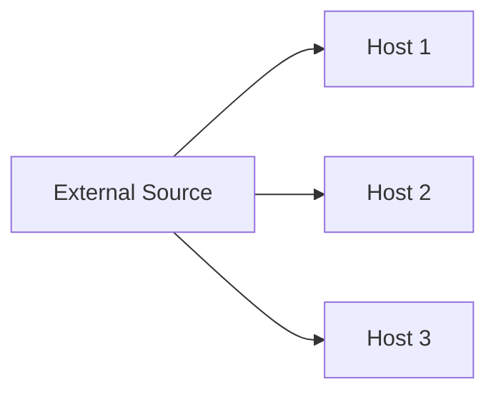
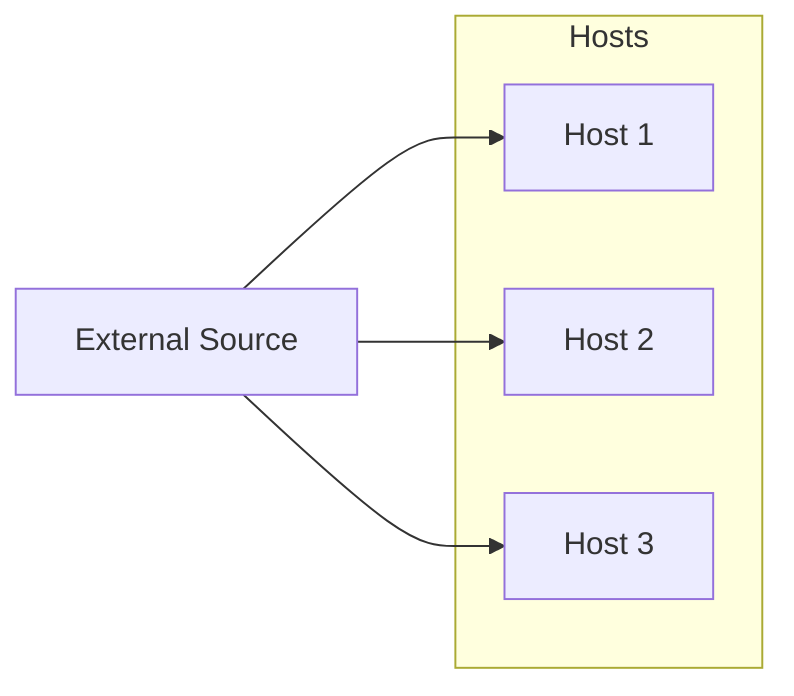
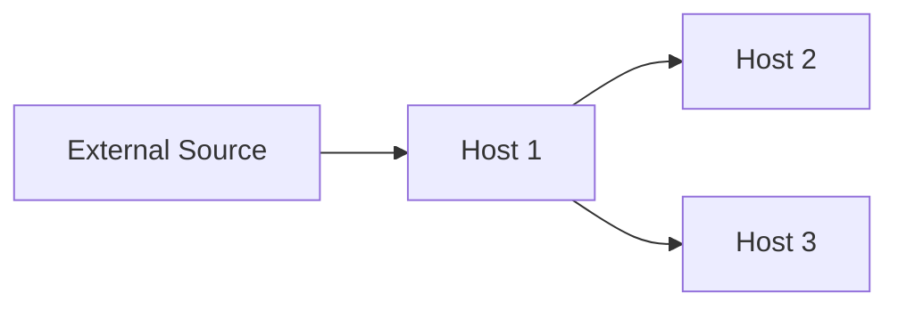
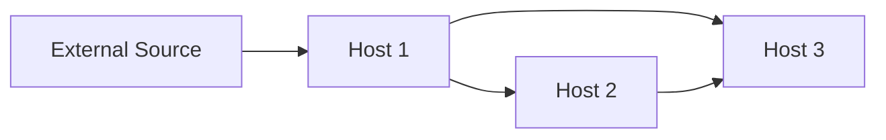
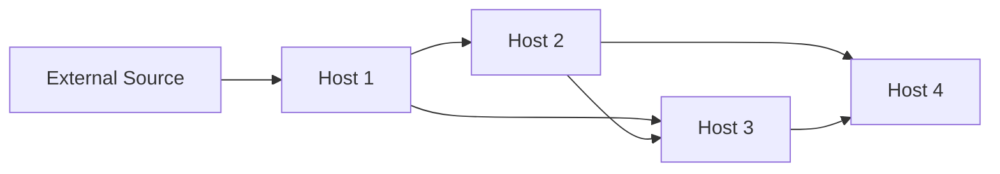

Perfect! Let’s design a **staged evolution of the ML model distribution architecture**, from the simplest “one-by-one” approach to a fully parallelized, peer-assisted swarm (abstracted, not mentioning BitTorrent). Each stage will include:

* **Description / What it does**
* **Problem it solves**
* **Remaining problems**
* **Trade-offs**

We’ll use **Mermaid diagrams** for illustration.

---

# Stage 1 — Sequential Delivery (Pipe)

**What it does:**

* External source sends the full model to each host **one at a time**.
* Host receives the full model, then the next host starts.

**Problem it solves:**

* Simple and reliable. Easy to implement.

**Problems remaining:**

* Extremely slow; total time ≈ `N × S / B_ext`.
* Internal network underutilized.
* No fault tolerance beyond simple retries.

**Trade-offs:**

* ✅ Very simple, no coordination required.
* ❌ Slow and does not leverage parallelism.

**Mermaid Diagram:**

---

# Stage 2 — Parallel External Push

**What it does:**

* External source sends the model to **all hosts in parallel** (or a batch of hosts limited by its bandwidth).
* Each host receives the full model independently.

**Problem it solves:**

* Speeds up delivery by using **external bandwidth fully**.

**Problems remaining:**

* Internal network may still be underutilized if hosts don’t share data.
* External bandwidth is now the bottleneck for large host counts.
* No redundancy; failures require re-pull from external source.

**Trade-offs:**

* ✅ Faster than sequential.
* ❌ Still limited by external bandwidth.
* ❌ Internal network is idle, no host-to-host distribution.

**Mermaid Diagram:**

---

# Stage 3 — Simple Host-Assisted Distribution

**What it does:**

* Some hosts that have received the model **start sending it to others**.
* External source only delivers to a few hosts.

**Problem it solves:**

* Reduces pressure on external link.
* Starts using internal bandwidth.

**Problems remaining:**

* Coordination needed to prevent multiple hosts sending the same copy redundantly.
* Potential network hotspots.
* Failure of initial hosts slows distribution.

**Trade-offs:**

* ✅ Reduces external load.
* ✅ Starts using internal network.
* ❌ Still needs careful scheduling to avoid congestion.

**Mermaid Diagram:**

---

# Stage 4 — Coordinated Parallel Distribution

**What it does:**

* Hosts share **portions of the model** with each other in parallel.
* Coordination system tracks which hosts have which portions to **avoid duplication**.

**Problem it solves:**

* Efficiently utilizes **internal bandwidth**.
* Reduces total delivery time substantially.

**Problems remaining:**

* Coordination complexity increases.
* Need fault-tolerance for host failures.
* Optimal scheduling still challenging.

**Trade-offs:**

* ✅ Much faster than previous stages.
* ✅ Uses internal network efficiently.
* ❌ Requires tracking of partial progress.

**Mermaid Diagram:**

---

# Stage 5 — Fully Parallel, Peer-Assisted Swarm

**What it does:**

* Hosts share **portions of the model dynamically** with each other as soon as they receive them.
* Coordinator monitors progress and ensures **all portions reach all hosts**.
* External source may serve only a small portion.

**Problem it solves:**

* Minimizes total delivery time using **both external and internal bandwidth fully**.
* Resilient to host failures.

**Problems remaining:**

* Coordination system must handle **rapidly changing host state**.
* Internal congestion must be monitored to avoid oversaturation.

**Trade-offs:**

* ✅ Fastest completion time.
* ✅ Fault-tolerant.
* ❌ Most complex; requires careful scheduling and tracking.

**Mermaid Diagram:**

---

### Summary of Stages

| Stage | Approach                   | Problem Solved                            | Remaining Problems                         | Trade-offs                      |
| ----- | -------------------------- | ----------------------------------------- | ------------------------------------------ | ------------------------------- |
| 1     | Sequential                 | Works reliably                            | Very slow, underutilized network           | Simple                          |
| 2     | Parallel external push     | Faster, uses external link                | Internal network idle, external bottleneck | Medium complexity               |
| 3     | Host-assisted distribution | Reduces external load                     | Coordination needed, failure impacts       | Internal network partially used |
| 4     | Coordinated parallel       | Efficient internal usage                  | Coordination and fault-tolerance           | More complex                    |
| 5     | Fully peer-assisted swarm  | Max bandwidth utilization, fault-tolerant | Complex coordination, scheduling           | Fastest, complex                |

```mermaid
flowchart TB
    %% Stage 1: Sequential Delivery
    subgraph Stage1[Stage 1: Sequential Delivery]
        E1[External Source]
        H1_1[Host 1]
        H1_2[Host 2]
        H1_3[Host 3]
        E1 --> H1_1
        E1 --> H1_2
        E1 --> H1_3
        class Stage1 stroke:#f66,stroke-width:2px;
    end

    %% Stage 2: Parallel External Push
    subgraph Stage2[Stage 2: Parallel External Push]
        E2[External Source]
        H2_1[Host 1]
        H2_2[Host 2]
        H2_3[Host 3]
        E2 --> H2_1
        E2 --> H2_2
        E2 --> H2_3
        class Stage2 stroke:#f96,stroke-width:2px;
    end

    %% Stage 3: Simple Host-Assisted
    subgraph Stage3[Stage 3: Host-Assisted Distribution]
        E3[External Source]
        H3_1[Host 1]
        H3_2[Host 2]
        H3_3[Host 3]
        E3 --> H3_1
        H3_1 --> H3_2
        H3_1 --> H3_3
        class Stage3 stroke:#fc0,stroke-width:2px;
    end

    %% Stage 4: Coordinated Parallel
    subgraph Stage4[Stage 4: Coordinated Parallel Distribution]
        E4[External Source]
        H4_1[Host 1]
        H4_2[Host 2]
        H4_3[Host 3]
        E4 --> H4_1
        H4_1 --> H4_2
        H4_1 --> H4_3
        H4_2 --> H4_3
        class Stage4 stroke:#6c6,stroke-width:2px;
    end

    %% Stage 5: Fully Parallel Peer-Assisted
    subgraph Stage5[Stage 5: Fully Peer-Assisted Swarm]
        E5[External Source]
        H5_1[Host 1]
        H5_2[Host 2]
        H5_3[Host 3]
        H5_4[Host 4]
        E5 --> H5_1
        H5_1 --> H5_2
        H5_1 --> H5_3
        H5_2 --> H5_3
        H5_2 --> H5_4
        H5_3 --> H5_4
        class Stage5 stroke:#6cf,stroke-width:2px;
    end
```

### How to interpret the diagram:

* Each **subgraph** represents a stage in the evolution.
* **External Source → Hosts** links show the initial model delivery.
* **Host-to-Host links** appear as the system evolves, illustrating **internal sharing and parallelism**.
* Colors indicate increasing complexity and efficiency:

    * Red → Stage 1 (simple, slow)
    * Yellow → Stage 3 (partially internal network used)
    * Green/Blue → Stage 4-5 (fully parallel, efficient, fault-tolerant)

---

This **one diagram clearly communicates**:

* How the system starts very simple.
* How it gradually leverages **parallelism, internal bandwidth, and redundancy**.
* What the trade-offs are at each stage (from simplicity → complexity).

