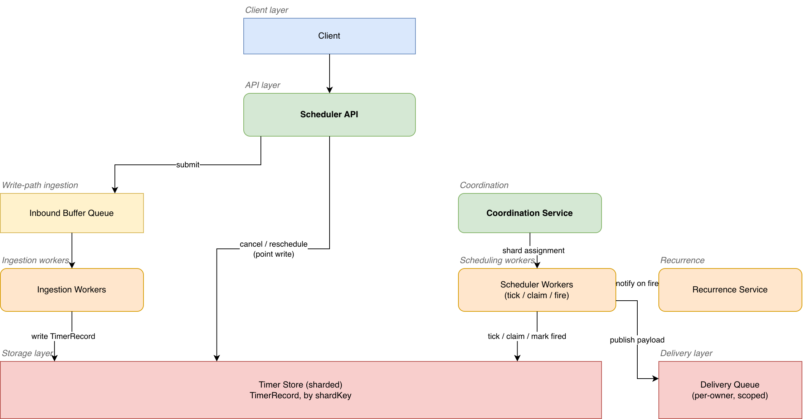

# Distributed Delayed Job / Scheduled Task Execution System

Generic design for a system that lets a client schedule a task to run at (or
after) a specific future time, at scale — e.g. "design a distributed cron",
"design a delayed message queue", "design a Redis/DynamoDB-backed job
scheduler". No vendor-specific or workflow-engine framing; the same
timer-storage and sharding patterns apply to any delayed-execution product.

---

## 1) Clarification Questions (FR → NFR)

**Functional Requirements (FR)**

1. Is a scheduled job one-shot (fire once at time T), recurring (cron-style,
   fire every N minutes), or both? This changes whether "job" and "timer" are
   the same entity or a timer is regenerated after each firing.
2. What's the expected delay range — seconds to minutes (e.g. a retry
   backoff), or up to months/years (e.g. "remind this user in 90 days")? This
   drives whether a single timer-storage tier is sufficient or a tiered
   design (near-term vs. far-term) is needed.
3. Can an already-scheduled job be cancelled or rescheduled before it fires?
4. What does "firing" a job actually do — invoke a webhook, publish onto a
   downstream message queue, or execute inline application code? (This
   design treats firing as "hand the job off to a delivery queue"; what
   happens after that hand-off is the caller's concern.)
5. Is job payload size bounded (a small pointer/ID) or can it carry an
   arbitrary blob (megabytes of data)?

**Non-Functional Requirements (NFR)**

1. What's the required delivery-time precision — fire within 10 seconds of
   the target time, or sub-second? Precision tightens the trade-offs
   directly discussed in §9.2.
2. What's the target scale — thousands of concurrent outstanding timers, or
   hundreds of millions to billions? This is the single number that decides
   which timer-storage approach (§9.1) is viable at all.
3. At-least-once or exactly-once firing semantics? (At-least-once with an
   idempotent downstream consumer is the industry-standard answer — see §9.5
   — but the interviewer's answer here changes what "correct" means for the
   rest of the design.)
4. Durability requirement on scheduler-node crash — is losing a small window
   of already-fired-but-unacknowledged jobs acceptable, or must every
   accepted job survive any single-node failure?
5. Availability vs. consistency preference under partition — should the
   system keep accepting new schedule requests during a partial outage even
   if it means degraded firing precision, or is late-but-correct preferred
   over never dropping precision guarantees?

---

## 2) Functional Requirements (FR)

- A client can schedule a job: submit a payload plus either an absolute
  target execution time or a relative delay, and receive back a unique job
  ID.
- A client can cancel a previously scheduled job by its job ID, provided it
  hasn't already fired.
- A client can reschedule a job (change its target time) by job ID without
  needing to cancel-and-resubmit.
- The system fires the job at (or after, never before) its target time by
  handing the payload off to a delivery mechanism (a downstream queue/topic,
  scoped per calling service so that one service's job volume can't starve
  another's — the isolation requirement below).
- The system reports each job's current state (`Scheduled`, `Fired`,
  `Cancelled`) to the owning client on request. (`Acquired` is an internal,
  sub-second transitional state used for the claim protocol in §9.5 and is
  never reported to a client — a client sees `Scheduled` up until the job is
  durably `Fired`.)
- Recurring jobs (if in scope per §1) are represented as a schedule
  definition (e.g. a cron expression) that the system re-derives the next
  one-shot timer from after each firing.

---

## 3) Non-Functional Requirements (NFR)

- Reliability: the system must not lose an accepted job on a node crash or
  restart — it guarantees at-least-once delivery of every job it has
  acknowledged (§9.4, §9.5).
- Horizontal scalability: no single node's memory or disk can be the ceiling
  on how many outstanding timers the system can hold — timer storage and the
  scheduling workload itself must shard across many nodes (§9.1, §9.4).
- Timing accuracy: firing happens within a bounded deviation of the
  requested target time (e.g. p95 within single-digit seconds) — this is a
  tunable target, not an absolute real-time guarantee, and is directly in
  tension with the scale NFR above (§9.2).
- Isolation: one calling service's job volume (a burst of millions of
  timers) must not degrade delivery precision or availability for another
  service's jobs (the same principle as isolating one noisy tenant from
  another in any multi-tenant system).
- Cheap cancellation/reschedule: cancelling or moving a single already-
  scheduled job must be a targeted, low-cost operation — it must not require
  scanning or rewriting any other outstanding timer (§9.6).
- No two workers concurrently initiate the same fire, including during a
  rebalance (§9.5) — this is a stronger guarantee than duplicate-_delivery_
  prevention: a single worker's own retry of a publish it already claimed
  can still redeliver the same job once, so downstream consumers must be
  idempotent (§9.5).

---

## 4) Back-of-the-Envelope (BOTE) Calculations

Example: 500M outstanding scheduled jobs at any given moment (a mid-size
platform's aggregate retry timers, reminder jobs, and delayed-webhook
backlog), average job payload 200 bytes, average fan-in rate of 50K new
jobs/sec and roughly matching firing rate at steady state.

- **Storage footprint:** 500M jobs × (200 bytes payload + ~50 bytes of
  metadata: job ID, target time, owner/tenant ID, status) ≈ 500M × 250 bytes
  ≈ 125 GB of raw timer data — comfortably shardable across a modest cluster
  of storage nodes, with room to grow an order of magnitude before storage
  capacity (as opposed to query/scan cost, see below) becomes the
  bottleneck.
- **Write/read rate:** 50K new schedules/sec (write) + 50K cancellations or
  reschedules/sec (read + write) + 50K fires/sec (read + delete) at steady
  state ≈ 150K operations/sec against timer storage — this is the number
  that rules out any approach requiring a full-table scan per tick (§9.1):
  a naive poll-every-row-every-tick design at a 1-second tick interval would
  need to scan all 500M rows every second just to find the handful that are
  due, which is off by many orders of magnitude from what's affordable.
- **Precision vs. shard count:** if the scheduling workload is sharded
  across N scheduler nodes so that no single node is a firing bottleneck,
  and each node needs to check its shard's soonest-due timers on a fixed
  tick interval, then tick interval directly caps precision: a 1-second tick
  means firing can lag its target time by up to ~1 second even in the
  best case, before any queueing or dispatch latency is added (§9.2 covers
  why shrinking the tick isn't free).
- **Cross-node duplicate-firing risk window:** during a rebalance affecting
  a shard with, say, 500K timers, the interval between "old owner stops
  ticking that shard" and "new owner starts" is the exposure window for
  either a missed fire (if too short a gap is assumed) or a duplicate fire
  (if both old and new owner tick briefly at once) — this is why ownership
  handoff needs an explicit protocol rather than an implicit timing
  assumption (§9.4, §9.5).

---

## 5) Core Data Entities

Traced from the actual read/write pattern in the pipeline (§8), not
independently invented — every field below has a specific producer and
consumer stage.

- **TimerRecord** (one row per outstanding job, the core entity the whole
  system is built around): `jobId` (client-visible, globally unique),
  `shardKey` (derived from `jobId`, used to route the row to a specific
  storage partition — §9.4), `targetTime` (absolute timestamp the job should
  fire at), `payload` (or a pointer to it if oversized per §1), `ownerId`
  (the calling service/tenant, used for isolation and for scoping the
  delivery queue), `status` (`Scheduled` / `Acquired` / `Fired` /
  `Cancelled`), `createdAt`, `version` (optimistic-concurrency token,
  incremented on every update — this is what makes the "claim before firing"
  step in §9.5 race-safe).
- **ScheduleDefinition** (only if recurring jobs are in scope per §1): one
  row per recurring job, holding the cron-style recurrence rule plus
  `ownerId` and `payload` template. A `ScheduleDefinition` doesn't sit in the
  hot timer-storage path itself — it's read once per firing to derive the
  _next_ one-shot `TimerRecord`, keeping the hot path (§8) working with a
  single record shape regardless of whether the job is one-shot or
  recurring.
- **ShardAssignment** (ephemeral, held by the coordination layer, not
  durable application data): `shardId` → `ownerNodeId` mapping, the record
  of which scheduler node currently owns ticking responsibility for which
  shard range. This is what a rebalance actually mutates (§9.4).

Two structurally different lookups fall out of this model, both required on
the hot path (§8):

1. **"Which timers in my shard are due right now?"** — answered by a
   range query against `TimerRecord` ordered by `targetTime` within a shard,
   which is exactly the access pattern the storage layer is chosen around
   (§9.1).
2. **"Does this specific job ID still exist, and can I cancel/reschedule
   it?"** — answered by a point lookup on `jobId` (via `shardKey`), a
   completely different access pattern from the range scan above, and the
   reason cancellation is cheap (§9.6) rather than requiring the range-scan
   structure to be disturbed.

---

## 6) System Interfaces

**Write path:**

- `POST /v1/jobs` — body: `payload`, `targetTime` (or `delaySeconds`),
  `ownerId` (derived from the caller's auth context). Creates a
  `TimerRecord` with `status = Scheduled`. Returns `jobId`.
- `DELETE /v1/jobs/{jobId}` — cancels the job if it hasn't already fired
  (`status` transitions to `Cancelled`); a no-op (idempotent) if it's
  already fired or cancelled. §9.6 covers why this is a single targeted
  write, not a scan.
- `PATCH /v1/jobs/{jobId}` — body: new `targetTime`. Reschedules the job in
  place (§9.6); rejected (`409`) if the job has already fired.
- `POST /v1/schedules` (recurring, if in scope) — body: cron expression,
  `payload` template, `ownerId`. Creates a `ScheduleDefinition` and its
  first derived `TimerRecord`.

**Read path:**

- `GET /v1/jobs/{jobId}` — auth via `ownerId` scoping; the API routes the
  lookup by `shardKey` (derived from `jobId`, §5) directly to the owning
  Timer Shard and returns current `status`, `targetTime`, and `payload` —
  the same point-lookup path used for cancel/reschedule (§9.6), not a
  cross-shard scan.
- Internal only (not client-facing): the Scheduler Shard's periodic
  range-query against its own `TimerRecord` partition for
  `targetTime <= now`, which is the mechanism that drives §8's fire path,
  not a request a client ever issues directly.

---

## 7) Simple Design (Single Server, Naive Polling)

```
[Client schedules job] --> [Job DB: TimerRecord rows]

[Single background thread, every tick]
        |
        v
[SELECT * FROM TimerRecord WHERE targetTime <= now()]
        |
        v
[For each due row: publish to delivery queue, mark Fired]
```

**Flow:** one process, one database, a fixed-interval poll that scans the
_entire_ table every tick looking for due rows. Correct at small scale, but
doesn't survive the BOTE numbers in §4: the scan cost grows with total
outstanding timers, not with how many are actually due, so tick latency
degrades as the backlog grows — exactly the deficiency the real systems
researched for this design (§8, §9.1) were built to eliminate.

---

## 8) Enriched Design



Editable source: [`diagrams/enriched_architecture.drawio`](diagrams/enriched_architecture.drawio)

**Components & flow, traced against the entities in §5:**

1. **Submit path.** Client → Load Balancer → **Scheduler API**, which
   writes a new `TimerRecord` (`status = Scheduled`) into the sharded
   **Timer Store**, routed by `shardKey` (§9.4 covers the partitioning
   scheme). The API call returns as soon as the write is durably
   acknowledged — the client is never blocked on the job actually firing.
   For high-volume submitters, the API first lands the request onto an
   **Inbound Buffer Queue** (the same role Dynein's SQS-backed "inbound
   queue" plays: absorb a short write-side burst so a spike in submissions
   doesn't translate directly into write pressure against the Timer Store)
   before a small pool of ingestion workers drains it into `TimerRecord`
   writes at a steady, controlled rate.
2. **Sharding & ownership.** The Timer Store is partitioned across many
   **Timer Shards**; a **Coordination Service** (e.g. a consensus-backed
   membership/lock service) maintains the `ShardAssignment` mapping and
   hands each shard's ticking responsibility to exactly one **Scheduler
   Worker** at a time. Workers register with the Coordination Service and
   receive their shard assignment; on worker join/leave, the Coordination
   Service rebalances shard ownership (§9.4).
3. **Tick / fire path.** Each Scheduler Worker, on a fixed interval, issues
   a range query against its owned Timer Shard(s) for
   `targetTime <= now()` (or ticks an in-memory timing-wheel structure
   populated from that shard, §9.1). For each due `TimerRecord`, the worker
   performs a **conditional claim** — an optimistic-concurrency update
   (`status: Scheduled → Acquired`, checked against `version`) — before
   doing anything else. Only after the claim succeeds does the worker
   publish the payload onto the **Delivery Queue** (scoped per `ownerId` for
   isolation, §3) and mark the record `Fired`. §9.5 covers why the claim
   step, not the publish step, is what prevents duplicate firing.
4. **Cancellation / reschedule.** `DELETE`/`PATCH` requests go straight to
   the Scheduler API, which performs a single point-write against the exact
   `TimerRecord` (located via `shardKey`, no shard-wide scan) — cheap
   regardless of how many other timers exist in that shard (§9.6).
5. **Recurring jobs.** If in scope, a small **Recurrence Service** owns
   `ScheduleDefinition` rows; when a Scheduler Worker fires a job that
   originated from a `ScheduleDefinition`, it notifies the Recurrence
   Service (or the worker itself derives the next occurrence inline) to
   insert the next one-shot `TimerRecord`. This keeps the hot tick path
   (step 3) working with a single, uniform record shape.
6. **Delivery.** The Delivery Queue is the boundary of this design — once a
   payload is published there, downstream consumption (webhook call,
   message processed by the owning service) is the calling service's
   concern, not the scheduler's.

**Dependency behavior on failure or unavailability** (§9.4-§9.6 cover the
end-to-end incident scenarios; this is the per-dependency contract each
component assumes):

- **Inbound Buffer Queue unavailable:** Scheduler API falls back to
  synchronous rejection of the submit request (`5xx`) rather than silently
  dropping a job — an accepted job must eventually be scheduled.
- **Coordination Service unavailable:** existing shard assignments continue
  to be honored (workers keep ticking their last-known shard) but no new
  rebalance can happen — a worker that crashes during this window leaves
  its shard un-ticked until the Coordination Service recovers. This is a
  bounded, temporary precision degradation, not data loss, since
  `TimerRecord`s survive in the durable Timer Store regardless.
- **Timer Shard unavailable:** that shard's jobs neither fire on schedule
  nor accept new submissions/cancellations until it recovers or fails over
  to a replica — this is a hard dependency (the durable source of truth),
  so Timer Shard availability (via replication) is the tightest SLA in the
  system.
- **Delivery Queue unavailable:** Scheduler Worker retries the claim-and-
  publish step (the claim itself is already durable, so a publish failure
  doesn't lose the job) rather than marking the record `Fired` until
  publish actually succeeds.

---

## 9) Deep Dives (Problem → Solutions → Preferred → Trade-offs)

### 9.1 Timer Storage & Retrieval at Scale

- **Problem:** finding "which timers are due right now" out of hundreds of
  millions of outstanding timers, on every tick, is the core operation the
  entire system's throughput depends on (§4). A naive full-table scan
  (§7) is correct but its cost scales with total outstanding timers, not
  with how many are actually due — it degrades continuously as the backlog
  grows, exactly backwards from what's needed.
- **Solutions:**
  - **Priority-queue / sorted-index approach** (e.g. a database index or a
    key-value store's sort key ordered by `targetTime`, per shard): a range
    query `targetTime <= now()` is efficient (logarithmic to locate the
    start of the range, then linear in the number of due rows only) as long
    as the underlying store supports an efficient range scan on a sorted
    key. This is the approach a DynamoDB-style store with a partition key +
    sort key naturally provides — insert is O(log n) or better, and a
    worker never touches rows that aren't due yet.
  - **Hierarchical timing wheel** (in-memory, per-shard): instead of a
    query against durable storage on every tick, timers are held in a
    circular array of "buckets" per unit of time, cascading to
    coarser-grained wheels for longer delays and being reinserted into
    finer wheels as their due time approaches (this is precisely the
    approach Kafka's request-purgatory timer adopted internally). Insert
    and cancel are both O(1) (aside from the O(m) cost of walking m wheel
    levels for very long delays), versus O(log n) for a priority-queue-based
    timer — a real, measured difference at high enough insert/cancel rates
    (the original benchmark comparing this approach against a naive
    per-item delay queue showed several-times higher sustained throughput
    once request volume was high enough to make per-operation overhead the
    bottleneck).
  - **Pure in-memory priority queue / min-heap per shard:** the classic
    single-process approach (e.g. `DelayQueue`) — O(log n) insert/delete,
    trivial to reason about, but the whole shard's timer set must fit in
    one node's memory and is lost on that node's crash unless backed by a
    durable log.
- **Preferred:** a durable, sorted (partition-key + sort-key) store as the
  source of truth for every `TimerRecord` (this is what makes the system
  survive a worker crash without losing timers — see §9.4), with an
  **optional in-memory timing-wheel or bounded look-ahead cache layered on
  top per shard** for the near-term horizon (e.g. the next few minutes of
  due timers), refilled periodically from the durable store via range
  query. Far-future timers (the "not due for weeks" tail) simply sit in
  durable storage unindexed-in-memory until they enter the near-term
  window — there's no benefit to holding a timer in an in-memory wheel
  months before it's due.
- **Trade-off:** the hybrid approach means two data structures to keep
  consistent (the durable store and the in-memory near-term cache) instead
  of one, and a worker crash loses the in-memory cache's state — but that's
  fine specifically because the durable store is unaffected and the cache
  is trivially rebuilt via range query on worker restart (§9.4). A pure
  in-memory timing wheel with no durable backing would be faster but
  violates the durability NFR (§3) outright; a pure durable-store-only
  design (no in-memory layer) is simpler operationally but pays a query
  round-trip on every tick even when nothing changed, at real cost once
  tick frequency and shard count both scale up.

### 9.2 Precision vs. Scalability Trade-off

- **Problem:** tick interval directly caps how close to the target time a
  job can fire (§4) — shrinking it improves precision but multiplies the
  number of range queries (or wheel ticks) issued per unit time across
  every shard, which is exactly the throughput cost the sharding design
  (§9.4) exists to keep bounded. Precision and per-node query load pull in
  opposite directions as timer count grows.
- **Solutions:** a single global tick interval tuned for the tightest
  required precision across all jobs (simple, but wastes work on shards
  with few or no near-term-due timers) vs. per-shard adaptive tick interval
  (a shard with no timers due in the next tick can back off and check less
  frequently; a shard with a hot near-term horizon ticks tighter) vs.
  accepting a coarser fixed interval uniformly and documenting it as the
  system's precision SLA rather than chasing sub-second accuracy
  everywhere.
- **Preferred:** a coarse, uniform tick interval (e.g. 1 second) as the
  advertised precision SLA, combined with per-shard adaptive backoff when a
  shard's near-term window is empty (skip the query entirely rather than
  querying and finding nothing, which is a cheap, purely local
  optimization that doesn't change the advertised SLA). Tightening the
  advertised SLA below what the adaptive-backoff approach can sustain at
  target shard count is treated as a capacity-planning question (add more,
  smaller shards) rather than a per-tick optimization problem — this
  mirrors the read/write BOTE reasoning in §4 directly.
- **Trade-off:** no amount of clever data structure removes the fundamental
  ceiling that tick interval imposes on precision — a 1-second tick simply
  cannot promise sub-second delivery no matter how the timer storage
  internally works. This must be stated as an explicit SLA to callers
  (§1's precision clarification), not glossed over; a caller genuinely
  needing sub-second precision at this timer volume needs either a
  fundamentally different design (dedicated, small-scale low-latency
  timers segregated from the bulk system) or a relaxed volume assumption,
  not a tuning knob on this same architecture.
- **Clock synchronization is an unstated dependency of the whole precision
  budget above:** the fire condition `targetTime <= now()` (§8 step 3) is
  evaluated independently on each Scheduler Worker's own wall clock, so a
  worker whose clock runs fast relative to the rest of the fleet fires
  early — violating the "never before its target time" guarantee in §2 —
  and a worker running slow adds directly to the delivery-lag budget on top
  of the tick interval. This design assumes bounded clock skew across
  Scheduler Workers (e.g. via NTP, with skew kept to tens of milliseconds),
  which must be stated as an explicit operational precondition rather than
  left implicit. Where the skew bound isn't trusted, each worker should
  subtract a fixed guard-band (sized to the worst-case tolerated skew) from
  its local `now()` before evaluating the fire condition, trading a small
  amount of additional lag for a hard guarantee against early firing.

### 9.3 Persistence & Durability on Scheduler Node Crash

- **Problem:** a Scheduler Worker holding in-flight state (its in-memory
  near-term cache from §9.1, or a job it's mid-way through claiming and
  publishing) can crash at any point in that sequence. The system must
  guarantee no accepted job silently disappears, without requiring every
  single tick to pay a full durability round-trip for state that's already
  durable elsewhere.
- **Solutions:** replay from a durable append-only log (every state
  transition — schedule, claim, fire, cancel — is written to a durable log
  before being applied, and a crashed worker's shard is recovered by
  replaying the log from the last checkpoint) vs. periodic snapshot of full
  in-memory state (cheaper per-tick, but a crash between snapshots loses
  any state mutated since the last snapshot) vs. leader-election handoff
  with no in-memory state at all (every tick re-reads directly from durable
  storage, so there's nothing to lose on crash, at the query-cost trade-off
  already discussed in §9.1/§9.2).
- **Preferred:** the durable-store-as-source-of-truth design already chosen
  in §9.1 makes this mostly free — since every `TimerRecord`'s current
  `status` and `version` live in the durable Timer Store (not only in a
  worker's memory), a crashed worker's in-memory near-term cache is simply
  discarded and rebuilt via range query by whichever worker inherits that
  shard (§9.4), with no separate replay-log mechanism needed specifically
  for the worker's own crash. This handles every state transition except
  one: a worker that crashes strictly between claiming a record
  (`status → Acquired`) and durably recording that its publish succeeded
  leaves that record stranded in `Acquired` — a range query for
  `targetTime <= now()` still finds it, but the claim protocol (§9.5) is
  specifically designed to make every _other_ worker skip a record it
  doesn't itself hold the claim on, so a naive inheriting worker skips it
  too and the job never fires. §9.5 covers the reclaim mechanism this
  requires.
- **Trade-off:** relying entirely on the durable Timer Store (rather than a
  separate replay log) means every meaningful state transition is a
  synchronous write to that store — there's no cheaper "log it now,
  durably persist it later" tier. This is accepted because the durability
  NFR (§3) requires it regardless, and because it avoids maintaining two
  separate sources of truth (the log and the store) that could disagree
  after a partial failure — a second, independent durability mechanism
  would only be justified if the Timer Store's own write latency became
  the bottleneck, which the BOTE numbers in §4 don't yet indicate at this
  scale.

### 9.4 Distributed Ownership / Sharding of Timers

- **Problem:** hundreds of millions of timers and tens of thousands of
  operations per second (§4) cannot be served by a single node's ticking
  loop or a single node's storage capacity. Timers must be partitioned
  across many Scheduler Workers and Timer Shards, and that partitioning
  must survive nodes joining and leaving without losing timers or leaving
  a shard un-ticked for long.
- **Solutions:** static, hand-assigned shard ranges (simple, but requires
  manual intervention on every capacity change and doesn't handle a crashed
  node automatically) vs. consistent hashing of `jobId` to a shard, with a
  Coordination Service dynamically assigning shard ranges to live worker
  nodes and rebalancing on membership change (the pattern Dynein's
  Kubernetes-based scheduler pods use: each pod deterministically computes
  its owned partition list from the current replica-set membership,
  picking up new partitions automatically as pods are added or removed) vs.
  a single active scheduler with hot standbys (simpler ownership model, but
  reintroduces a single-node throughput ceiling that contradicts the
  scalability NFR).
- **Preferred:** consistent-hash-based sharding with dynamic assignment via
  a Coordination Service, mirroring Dynein's approach. Each Scheduler
  Worker watches the current live-worker membership set (e.g. via the
  Coordination Service's group-membership primitive) and deterministically
  computes which shard range(s) it owns from that membership list, with no
  central "assign shard N to worker M" bookkeeping required beyond the
  membership list itself. On worker join or leave, every remaining worker
  recomputes its owned ranges from the new membership and picks up (or
  releases) shards automatically.
- **Trade-off:** dynamic rebalancing means a shard can briefly have zero
  or (worse) more-than-one owner during the handoff window — the interval
  the BOTE in §4 flagged as the duplicate-firing/missed-firing exposure
  window. This is deliberately treated as a separate, explicit problem
  (§9.5) rather than assumed away, because a naive "whoever computes
  ownership first wins" protocol is exactly what produces the double-firing
  race this design must prevent.

### 9.5 Exactly-Once vs. At-Least-Once Firing Semantics

- **Problem:** two Scheduler Workers could, even briefly, both believe they
  own the same shard — during a rebalance (§9.4), during a network
  partition where the old owner hasn't yet realized it lost ownership, or
  during a slow Coordination Service failover. If both workers independently
  see the same due `TimerRecord` and both publish it to the Delivery Queue,
  the job fires twice — violating the no-duplicate-firing NFR (§3).
- **Solutions:** rely purely on rebalance timing to avoid overlap (assume
  the old owner always stops before the new owner starts — fragile, and
  exactly the assumption that breaks under a slow network or a
  Coordination Service hiccup) vs. a distributed lock held for the entire
  fire operation (correct, but adds lock-acquisition latency to every
  single fire, at real cost given the operation rate in §4) vs. an
  optimistic-concurrency **conditional claim** on the individual
  `TimerRecord` before publishing (the approach in §8 step 3: a
  `status: Scheduled → Acquired` update guarded by the record's `version`
  field succeeds for at most one concurrent writer; a second worker's
  claim attempt on the same record fails immediately and that worker
  simply skips the record rather than publishing it).
- **Preferred:** the conditional-claim approach — it makes the unit of
  mutual exclusion the individual timer record rather than the whole
  shard, so it's correct even during the exact window (§9.4) where shard
  ownership is briefly ambiguous, without needing a coarse-grained
  distributed lock at all. Firing itself remains at-least-once end-to-end
  (a worker that claims a record and crashes before confirming the publish
  succeeded may retry the publish, so the downstream consumer must be
  idempotent or dedupe by `jobId`), but duplicate _initiation_ of the
  publish step by two different workers racing on the same record is
  prevented by construction.
- **Trade-off:** this pushes the idempotency requirement downstream — the
  system guarantees at-least-once delivery to the Delivery Queue, not
  exactly-once end-to-end delivery to whatever ultimately consumes the
  job, and callers must dedupe by `jobId` on their side if a duplicate
  delivery would be unsafe. True end-to-end exactly-once would require a
  transactional hand-off between the claim and the publish (e.g. a
  two-phase commit or a transactional outbox spanning both the Timer Store
  and the Delivery Queue), which is a heavier mechanism this design
  deliberately avoids because at-least-once-plus-idempotent-consumer is the
  standard, cheaper answer accepted industry-wide for this class of
  problem.
- **Reclaiming a stuck claim:** the conditional-claim protocol above
  prevents duplicate initiation, but it introduces its own failure mode —
  if the worker that claimed a record (`status → Acquired`) crashes before
  either publishing or failing the publish, the record is stuck in
  `Acquired` forever, since every other worker's claim protocol is built to
  skip a record it doesn't hold the claim on (§9.3). The fix is to make the
  claim a **leased** claim: the `Acquired` write carries a lease expiry
  (e.g. `claimedAt + leaseDuration`, a small multiple of the expected
  publish latency), and any worker's tick sweep treats a record still
  `Acquired` past its lease expiry as eligible for reclaiming — a fresh
  conditional update back to `Acquired` with a new `version` and a new
  lease, exactly as if it were newly due. This bounds the maximum time a
  crashed worker's claim can block a job's delivery to one lease interval,
  and reuses the same `version`-guarded conditional-write mechanism already
  in place, rather than introducing a separate cleanup process.

### 9.6 Cancellation / Rescheduling Without Rescanning

- **Problem:** a naive design that keeps timers purely inside an
  append-only or scan-oriented structure (e.g. a plain sorted list with no
  point-lookup index) makes "cancel job X" or "move job X to a new time"
  expensive — it has to search for the specific record among everything
  else in the shard. At the operation rate in §4 (tens of thousands of
  cancels/reschedules per second), this must be a cheap, targeted operation
  or it becomes its own bottleneck, independent of the fire-path cost
  already addressed in §9.1.
- **Solutions:** scan the shard's full timer range looking for the matching
  `jobId` (correct, but its cost scales with shard size, exactly the
  problem being avoided everywhere else in this design) vs. maintain a
  direct point-index from `jobId` to its current storage location
  (`shardKey` + `targetTime`), so cancel/reschedule is a single indexed
  lookup plus a single write, independent of how many other timers exist
  in that shard.
- **Preferred:** the point-index approach — this falls directly out of the
  `TimerRecord` schema already chosen in §5 (`jobId` as the primary
  addressable key, `shardKey` derived deterministically from it), so no
  extra index structure is needed beyond what routing already requires.
  Cancel is a single conditional update (`status → Cancelled`, guarded by
  `version` so a cancel racing against an in-flight claim/fire loses
  cleanly rather than corrupting state); reschedule is a single update to
  `targetTime` (also `version`-guarded), which — if the record is backed
  by an in-memory timing wheel per §9.1 — simply means removing it from its
  old bucket and reinserting into the new one, both O(1) operations, not a
  structural rebuild of the wheel.
- **Trade-off:** none, really, relative to the alternative — maintaining a
  point-index by `jobId` is essentially free given that `jobId` is already
  the client-facing handle every cancel/reschedule request must supply, and
  the sharding scheme (§9.4) already routes by a hash of that same key. The
  only real cost is ensuring the `version`-guard is checked consistently on
  every mutation path (claim, cancel, reschedule) so they can't silently
  race each other — a correctness requirement, not a performance one.

### 9.7 Operational Runbook Hooks

The deep dives above describe system behavior under failure; the following
are procedures an on-call operator would actually run in response:

- **Stuck-`Acquired` sweep (manual escalation path):** the lease-based
  reclaim in §9.5 handles the common case automatically, but if lease
  expiry itself is misconfigured or a bug prevents the automatic sweep from
  running, an operator needs a query to list `TimerRecord`s in `Acquired`
  with `claimedAt` older than N lease intervals, and a manual action to
  force-reset them to `Scheduled` (bumping `version`) so the normal fire
  path picks them up again on the next tick.
- **Manual shard-ownership reassignment during a Coordination Service
  outage:** §8 notes that existing shard assignments continue to be
  honored while the Coordination Service is down, but a worker that dies
  during that window leaves its shard un-ticked with no automatic
  reassignment possible. An operator needs a documented manual override —
  directly writing a `ShardAssignment` entry (bypassing the normal
  membership-driven computation in §9.4) to hand that shard to a live
  worker — to bound the outage window instead of waiting for the
  Coordination Service to recover on its own.
- **Precision SLA burn-down check:** since the advertised precision SLA
  (§9.2) depends on tick interval, shard count, and bounded clock skew all
  holding simultaneously, an operator investigating a precision-SLA
  violation should check, in order: per-shard tick latency (is a shard
  overloaded — capacity question per §9.2), clock-skew metrics across
  Scheduler Workers (is the NTP assumption in §9.2 actually holding), and
  Inbound Buffer Queue depth (is ingestion lag delaying when jobs even
  become visible to the Timer Store).

---
