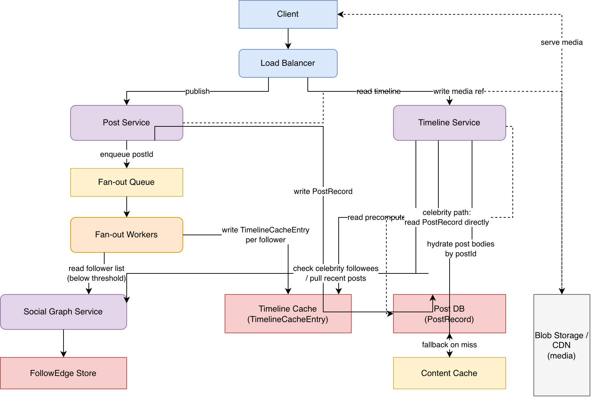

# Twitter-like Feed / Timeline System

Generic feed/timeline design — asymmetric follow graph, reverse-chronological or
ranked home timeline. No vendor-specific or workflow-engine framing; the same
fan-out and caching patterns apply to any social feed product.

---

## 1) Clarification Questions (FR → NFR)

**Functional Requirements (FR)**

1. Is the follow graph symmetric (mutual friends, capped follower count) or
   asymmetric (follower/followee, some accounts with tens of millions of
   followers)? This single answer determines whether the celebrity/hot-user
   problem exists at all.
2. Is the home timeline strictly reverse-chronological, or does it need
   ranking/relevance scoring?
3. Does a post support edit after publish, or is it immutable (delete-only)?
4. Is media (image/video) attachment in scope, or text-only posts?
5. Do we need real-time delivery (e.g. a live-updating timeline via
   websocket/push) or is poll-on-load acceptable?

**Non-Functional Requirements (NFR)**

1. What is the target read latency for loading a timeline page (e.g. p99
   under 200ms)?
2. What is the expected read:write ratio? (Feed systems are read-heavy —
   getting an order-of-magnitude number here, e.g. 100:1 or higher, shapes
   every caching decision downstream.)
3. Is eventual consistency acceptable for timeline delivery (a follower seeing
   a new post seconds late), or must it be immediately visible?
4. What's the largest expected follower count for a single account (drives
   whether/how aggressively the celebrity case must be engineered for)?
5. Availability vs. consistency preference under partition — for a feed
   product, staying available and slightly stale is almost always preferred
   over rejecting reads/writes.

---

## 2) Functional Requirements (FR)

- A user can publish a post (text, optionally with media).
- A user can view their home timeline: an aggregation of recent posts from
  everyone they follow, in reverse-chronological order by default.
- A user can follow/unfollow another user (asymmetric — following someone
  doesn't require their consent or reciprocation).
- A user can view another user's own profile timeline (their posts only).
- Likes/replies/reposts are tracked as counters against a post (detailed
  design of the social-graph interactions themselves is out of scope; what
  matters here is that counters are read alongside timeline content and must
  not force an extra per-post round trip on the hot read path).
- Deleting a post removes it from every timeline that has already fanned it
  out, not just from the author's own profile.
- (Optional, if ranking is in scope) The timeline can be ordered by a
  relevance score instead of strict recency.

---

## 3) Non-Functional Requirements (NFR)

- Low read latency: loading a timeline page is the single most frequent,
  most latency-sensitive operation in the system and must stay fast under
  load — this NFR is what makes "precompute at write time" attractive despite
  its cost, and is revisited directly in §9.1 and §9.5.
- Read-heavy at scale: reads outnumber writes by one or more orders of
  magnitude, so read-path cost is optimized for even at the expense of extra
  write-path work.
- Availability over strict consistency: a follower seeing a new post a few
  seconds late is an acceptable trade-off; the system should not fail reads
  or writes over a replication lag.
- Horizontally scalable fan-out and storage — no single component can be
  sized for the average case and left to buckle at the celebrity-account
  case (§9.1).
- Bounded staleness: once a post is deleted or edited, the server-side read
  path must stop serving the stale version on the very next fresh read
  (§9.4) — no server-side unbounded staleness window, even though an
  already-rendered client screen can lag until its next refresh.
- Real-time delivery is out of scope for this design: the timeline is
  poll-on-load (client re-fetches via `GET /v1/timeline`), not a live-updating
  push/websocket feed. This directly answers FR clarification question 5
  (§1) — a push-based delivery layer is a separate, additive component that
  would sit on top of this design, not a replacement for it.
- Authorization: only a post's author (or an authorized moderator role, out
  of scope) may edit/delete it; a private account's posts must only be
  visible to its approved followers. This NFR is enforced end-to-end in
  §8's fan-out and read paths (§9.6).

---

## 4) Back-of-the-Envelope (BOTE) Calculations

Example: 500M DAU, average 200 follows per user, 200M posts/day.

- **Write-path fan-out volume:** 200M posts/day ÷ 86,400s ≈ 2,315 posts/sec
  average (peak likely several times higher, say ~10k posts/sec). If every
  post fans out to its author's average follower count, and average follower
  count roughly mirrors average follows (~200) for a typical account, that's
  ≈ 2,315 × 200 ≈ 463K timeline-cache writes/sec at average load just from
  ordinary accounts — this is the number the fan-out design must absorb, and
  it's already an order of magnitude larger than the post-write rate itself
  (write amplification, §9.5).
- **Celebrity accounts break the average-case math:** a single post from an
  account with 100M followers would, under naive fan-out-on-write, generate
  100M individual timeline-cache writes for that one post — comparable to
  roughly half a day's worth of aggregate ordinary-account fan-out writes,
  from one post. This is why celebrity accounts can't be handled by the same
  mechanism as ordinary ones (§9.1).
- **Timeline cache storage:** only post IDs (not full post bodies) are cached
  per user, keeping each cached entry ~8-16 bytes. Caching the most recent
  ~1,000 post IDs per active user × 500M DAU × ~16 bytes ≈ 8 GB of ID data
  aggregate for active-user timelines — the full post _content_ is fetched
  separately from a content store/cache keyed by post ID, not duplicated
  per-follower, since duplicating the ~1-2 KB body across every follower's
  cache entry would be storage-prohibitive at this scale.
- **Post content storage:** 200M posts/day × ~1 KB avg (text + metadata,
  excluding media which lives in blob storage/CDN separately) ≈ 200 GB/day,
  ≈ 73 TB/year before any replication factor.

---

## 5) Core Data Entities

Traced from the actual read/write pattern in the pipeline (§8), not
independently invented — every field below has a specific producer and
consumer stage.

- **PostRecord** (one row per post, keyed by `postId`): `postId`, `authorId`,
  `content`, `mediaPointers` (blob storage refs, if any), `createdAt`,
  `editedAt` (nullable), `deletedAt` (nullable — tombstone, not a hard
  delete; see §9.4 for why), `likeCount`, `replyCount`, `repostCount`
  (denormalized counters, updated by the respective interaction services —
  out of scope for this design beyond noting they ride along on the same
  read as the post body).
- **FollowEdge** (one row per follower→followee relationship): `followerId`,
  `followeeId`, `createdAt`. Stored in a graph-oriented or adjacency-list
  store; the Fan-out Service reads this to determine "who gets this post,"
  and the Timeline Service's pull path (§9.1) reads it to determine "whose
  posts do I merge on demand."
- **UserRecord**: `userId`, `displayName`, `avatarPointer`, `followerCount`
  (denormalized — this single field is what routes a post between the
  fan-out-on-write and fan-out-on-read paths, §9.1), `isPrivate` (whether the
  account's posts require an approved `FollowEdge` to view, §9.7).
- **TimelineCacheEntry** (one row per `<userId, postId>` pair, the
  precomputed home-timeline index for a user): `userId`, `postId`,
  `insertedAt` (used as the cursor sort key, §9.2). This is an ID-only
  index — never a copy of the post body — populated by the Fan-out Service
  at write time for ordinary accounts, and synthesized on demand by the
  Timeline Service's merge step for the celebrity-account portion of a
  user's feed (§9.1).

Two structurally different lookups fall out of this model, and both are
required on the read path — they answer different questions:

1. **"Which post IDs belong on this user's timeline, in order?"** — answered
   by `TimelineCacheEntry` for ordinary followees (precomputed), merged with
   an on-demand pull against `FollowEdge` + celebrity `PostRecord`s for
   followees over the fan-out threshold (§9.1).
2. **"What does this specific post actually contain?"** — answered by a
   separate `PostRecord` lookup (via a content cache in front of the
   database), keyed by the post IDs the first lookup returned. Separating
   these two is what keeps the ID index small (§4) and lets one post's
   content be fetched once regardless of how many timelines reference it.

---

## 6) System Interfaces

**Write path:**

- `POST /v1/posts` — body: `content`, optional `mediaPointers`; auth via
  token. Creates a `PostRecord` and triggers fan-out.
- `DELETE /v1/posts/{postId}` — auth via token; only the post's author may
  delete it (§9.7). Sets `deletedAt` (tombstone); does not synchronously
  purge every `TimelineCacheEntry` referencing it (§9.4).
- `PATCH /v1/posts/{postId}` — auth via token; only the post's author may
  edit it (§9.7). Sets `editedAt` and updates `content` (only if edit is in
  scope per §1).
- `POST /v1/follow` / `DELETE /v1/follow` — body: `followeeId`. Creates or
  removes a `FollowEdge`. If the target account is private, `POST /v1/follow`
  creates a pending request rather than an immediate edge (§9.7).

**Read path:**

- `GET /v1/timeline?cursor={cursor}&limit={n}` — auth via token; returns up
  to `n` posts older than `cursor`, filtered to only include posts the
  requesting user is authorized to see (§9.7) (cursor-based, not
  page-number/offset-based — see §9.2 for why). Response includes a
  `nextCursor` for the following page.
- `GET /v1/users/{userId}/posts?cursor={cursor}&limit={n}` — auth via token;
  a user's own profile timeline, same cursor convention. If `userId`'s
  account is private, only an approved follower (or the user themself) may
  read it (§9.7).

---

## 7) Simple Design (Single Server, Pull-Only)

```
[User posts] --> [Post DB]

[User requests timeline]
        |
        v
[Look up FollowEdge for this user's followees]
        |
        v
[Query Post DB for each followee's recent posts]
        |
        v
[Merge-sort all results by timestamp] --> [Return page to client]
```

**Flow:** no fan-out, no cache — every timeline load does the aggregation
work live. Correct but doesn't scale: a user following 200 accounts triggers
(at minimum) 200 separate lookups on every single timeline load.

---

## 8) Enriched Design



Editable source: [`diagrams/enriched_architecture.drawio`](diagrams/enriched_architecture.drawio)

**Components & flow, traced against the entities in §5:**

1. **Publish path.** Client → Load Balancer → **Post Service**, which writes
   the new `PostRecord` to the Post DB and pushes the `postId` + `authorId`
   onto a **Fan-out Queue**. The queue exists specifically to decouple "post
   accepted" (fast, returns to the client immediately) from "post delivered
   to every follower's timeline" (slow, proportional to follower count) —
   the client is never blocked waiting for fan-out to finish.
2. **Fan-out.** A pool of **Fan-out Workers** consumes the queue. For each
   post, the worker reads the author's `followerCount` from `UserRecord` and
   branches:
   - **Below the celebrity threshold:** read the full follower list from
     `FollowEdge`, and write one `TimelineCacheEntry` per follower into the
     **Timeline Cache**. This is fan-out-on-write — the cost is paid once,
     at publish time, so every follower's subsequent read is a cheap cache
     lookup.
   - **At or above the celebrity threshold:** skip per-follower fan-out
     entirely. The post is left discoverable only via the author's own
     `PostRecord`s; it's picked up by the read path's on-demand merge step
     instead (§9.1 covers why this split exists and where the threshold
     comes from).
3. **Read path.** Client → Load Balancer → **Timeline Service**, which:
   - Looks up the requesting user's precomputed `TimelineCacheEntry` page
     (cursor-based, §9.2) for ordinary followees.
   - Separately looks up which of the user's followees are celebrity
     accounts (via `UserRecord.followerCount` against `FollowEdge`), and
     pulls their most recent `PostRecord`s directly, merging them into the
     result set by timestamp.
   - Takes the merged, ordered list of post IDs and fetches the actual post
     bodies from a **Content Cache** in front of the Post DB (one lookup per
     distinct post ID, not per follower/timeline).
   - Returns the hydrated page plus a `nextCursor`.
4. **Social graph.** `FollowEdge` reads/writes go through a dedicated
   **Social Graph Service** — kept separate from the Post/Timeline services
   because follow-graph queries ("who does X follow," "is Y a celebrity
   followee of X") have a different access pattern and scaling profile
   (adjacency-list traversal) than post storage or timeline assembly.
5. **Media.** Any attached media is uploaded directly to blob storage and
   served through a CDN; `PostRecord.mediaPointers` only stores the
   reference, keeping media entirely off the write-amplified fan-out path.

**Dependency behavior on failure or unavailability** (§9.6 covers the
end-to-end incident scenarios; this is the per-dependency contract each
component assumes):

- **Fan-out Queue unavailable:** Post Service falls back to synchronous
  rejection of the publish request (`5xx`) rather than silently dropping
  fan-out — a post that's accepted must eventually fan out.
- **Timeline Cache unavailable:** Timeline Service serves only the
  celebrity/on-demand portion of the merged feed and returns a
  degraded (partial) response rather than failing the whole request outright.
- **Content Cache unavailable:** Timeline Service falls back to a direct
  Post DB read for hydration — slower, but not a hard failure.
- **Post DB unavailable:** both fan-out (celebrity path) and hydration fail;
  this is a hard dependency with no fallback, so Post DB availability is the
  tightest SLA in the system.

---

## 9) Deep Dives (Problem → Solutions → Preferred → Trade-offs)

### 9.1 Fan-out-on-Write vs. Fan-out-on-Read vs. Hybrid (the Celebrity Problem)

- **Problem:** precomputing every follower's timeline at post time
  (fan-out-on-write) makes reads cheap but makes a single post from a
  high-follower-count account catastrophically expensive to write (§4's
  100M-follower example) — and a large share of that fan-out work is wasted
  on followers who are inactive and may never actually load their timeline
  before the entry ages out. Computing every timeline at read time
  (fan-out-on-read) avoids that write spike entirely but makes every single
  read pay a live-aggregation cost, which conflicts directly with the
  read-heavy, low-latency NFR (§3) that the whole architecture exists to
  satisfy.
- **Solutions:** pure fan-out-on-write (fast reads, celebrity write spike
  and wasted work on inactive followers) vs. pure fan-out-on-read (bounded,
  predictable write cost, but every read is slow and repeats the same
  aggregation work for popular content) vs. a hybrid split by follower count.
- **Preferred:** hybrid — fan-out-on-write for accounts under a follower-count
  threshold (the overwhelming majority of accounts and posts), fan-out-on-read
  for accounts at or above it. The read path (§8) merges both sources
  transparently, so from the client's perspective there's one timeline API
  regardless of which mechanism produced each entry. The threshold itself is
  a tunable operational parameter (not a fixed universal constant) — set it
  where the write cost of fanning out one post to that many followers starts
  to noticeably compete with the fan-out worker pool's capacity for
  everyone else's ordinary-volume traffic.
- **Trade-off:** the hybrid split adds real complexity — the read path must
  merge two structurally different sources instead of reading one cache, and
  the "is this followee a celebrity" check itself must be cheap (a
  denormalized `followerCount` lookup, not a live `COUNT(*)` over
  `FollowEdge`) or it becomes its own bottleneck. This complexity is
  accepted because the alternative (either pure model) fails badly at one
  end of the follower-count distribution, and that distribution is
  genuinely bimodal in practice (most accounts have a handful to a few
  thousand followers; a small number have tens of millions).

### 9.2 Timeline Storage & Cursor-Based Pagination

- **Problem:** offset-based pagination (`?page=3&size=20`, or equivalently
  `OFFSET 40 LIMIT 20`) computes "page 3" by counting from the start of the
  result set every time. On a live, constantly-growing timeline, new posts
  are inserted at the front between page loads — the same item can shift
  from position 21 to position 22 mid-scroll, causing a client to either see
  a duplicate or skip an item entirely when it requests "the next 20 after
  offset 40." This isn't a rare edge case for a feed specifically; new
  inserts at the head of the list are the system's core, continuous
  behavior, not an occasional anomaly.
- **Solutions:** offset-based pagination (simple, but breaks under
  concurrent inserts as above) vs. cursor-based pagination, where the
  client passes back an opaque cursor derived from the last item it actually
  saw (`postId` + `insertedAt`/timestamp) and the server returns "everything
  older than this cursor," which is stable regardless of how many new items
  were inserted at the head in the meantime.
- **Preferred:** cursor-based pagination, with the cursor encoding
  `(insertedAt, postId)` — the timestamp for ordering and the post ID as a
  tiebreaker for entries with identical timestamps (which happen at scale).
  `TimelineCacheEntry.insertedAt` is exactly the field this cursor is built
  from (§5), so no extra index is needed beyond what fan-out already writes.
- **Trade-off:** cursor-based pagination can't jump to an arbitrary page
  number ("go to page 7") the way offset-based pagination nominally can —
  but that capability was never actually meaningful for an infinite-scroll
  timeline in the first place, so this is not a real loss for this specific
  use case (it would matter for, say, a paginated admin table with a fixed
  total count, which a timeline isn't).

### 9.3 Ranking / Relevance

- **Problem:** strict reverse-chronological ordering treats every followee's
  post as equally worth surfacing, which doesn't match what users actually
  find valuable — a close friend's post and a rarely-interacted-with
  account's post are weighted identically by recency alone.
- **Solutions:** pure chronological (simple, predictable, exactly what §7's
  simple design and §8's hybrid fan-out both produce with no extra work) vs.
  an ML-ranked feed, where a scoring model orders candidate posts by
  predicted engagement/relevance instead of raw timestamp.
- **Preferred:** chronological as the default and what the rest of this
  design assumes throughout, since it's what the FR clarification (§1)
  scopes unless told otherwise. If ranking is explicitly in scope: keep the
  candidate-generation step exactly as designed above (fan-out produces the
  candidate post-ID set, cursor-based retrieval still applies to _pages_ of
  the ranked result), and insert a separate scoring/ranking stage between
  "candidates assembled" and "response returned" that reorders the same
  candidate set — ranking changes _ordering_, not _which posts are
  eligible to appear_, so it composes with the fan-out/cache design instead
  of replacing it.
- **Trade-off:** chronological ordering is simpler, fully deterministic, and
  requires no model-serving infrastructure or training pipeline; ranking
  can meaningfully improve engagement but adds a real system (feature
  pipeline, model serving, A/B evaluation) that has its own latency budget
  and failure modes, worth building only once chronological is proven
  insufficient for the product's actual goals — this is deliberately kept
  brief here since the deeper ML-ranking design is its own separate topic,
  not a core hard problem of feed _architecture_ itself.

### 9.4 Cache Invalidation / Staleness on Delete or Edit

- **Problem:** once fan-out-on-write has copied a `postId` into potentially
  millions of `TimelineCacheEntry` rows, deleting or editing the original
  post doesn't automatically update or remove those copies — the ID index
  entries still point at a post that's now gone or changed, and unlike the
  celebrity read-time path (which re-reads `PostRecord` fresh on every
  request), the fanned-out ID entries were written once and can go stale.
- **Solutions:** eagerly walk every `TimelineCacheEntry` referencing the
  deleted/edited post and remove/update each one synchronously (correct, but
  exactly the same write-amplification problem fan-out-on-write already
  has — potentially millions of cache writes for one delete) vs. do nothing
  at the cache-entry level and instead treat the _content_ fetch as the
  single source of truth: the `TimelineCacheEntry` only ever stores a
  `postId`, never post content, and every read re-fetches the current
  `PostRecord` (including its `deletedAt`/`editedAt` state) at serve time.
- **Preferred:** the content-fetch-as-source-of-truth approach — this falls
  directly out of the ID-only cache design already chosen in §5/§8 for
  storage-size reasons, not an extra mechanism bolted on. When the Timeline
  Service hydrates a page of post IDs (§8, step 3), it checks
  `PostRecord.deletedAt`: if set, that entry is simply filtered out of the
  response (a tombstone, not a hard delete, so the check is a cheap field
  read rather than a "does this row still exist" query); if `editedAt` is
  newer than the client's last-seen version, the current content is served
  automatically since the fetch always reads the live row. No walk over
  stale `TimelineCacheEntry` rows is ever required — they harmlessly point
  at IDs that get filtered at hydration time, and a lazy, unforced cleanup
  (e.g. as part of normal cache eviction/TTL) can reclaim the dead ID
  entries later without it being a correctness requirement.
- **Trade-off:** this defers the "delete/edit is fully reflected everywhere"
  guarantee until the next time each individual timeline entry is actually
  hydrated — a page of stale, already-cached-client-side results (e.g. a
  mobile app holding an in-memory copy from a few minutes ago) can still
  show now-deleted content until it's refreshed from the server; the
  bounded-staleness NFR (§3) is satisfied at the _server_ boundary (every
  fresh server read is correct), not at every already-rendered client
  screen. Making it stronger than that would require either the expensive
  eager walk above or a push-based invalidation signal to every client
  session, both of which cost far more than this problem is usually worth
  solving completely.

### 9.5 Read/Write Amplification Trade-offs at Scale

- **Problem:** fan-out-on-write turns one post-write into potentially
  thousands of cache-writes (§4); fan-out-on-read turns one timeline-read
  into potentially hundreds of live lookups (§7's simple design). Neither
  number is "solved" by the hybrid design in §9.1 — the hybrid split just
  routes each post to whichever amplification is smaller for _that specific
  post's_ follower count, it doesn't eliminate amplification itself.
- **Solutions:** optimize purely for write cost (push everything to
  read-time aggregation — cheap, predictable writes, but the read NFR in §3
  is violated for every request, not just celebrity posts) vs. optimize
  purely for read cost (fan-out everything — the read NFR is met, but write
  cost is unbounded at the tail as shown in §4) vs. accept that the
  trade-off is inherent and split the traffic by which side of it each post
  actually falls on (§9.1's hybrid).
- **Preferred:** the hybrid split, because the read:write ratio NFR (§3) says
  reads vastly outnumber writes in aggregate — so it's correct to spend
  write-time work to make the _common_ read case cheap, as long as the
  _rare_ case (celebrity posts) that would make that write-time work
  unbounded is carved out and paid for differently instead. This is the same
  underlying reasoning as §9.1, restated as the general principle: the right
  default is "pay the cost on the side of the ratio that happens less
  often," and the celebrity threshold exists purely to keep that assumption
  true instead of it silently breaking for the tail of the distribution.
- **Trade-off:** no design here removes total amplification — it's inherent
  to any social graph with fan-out semantics (N followers means N copies of
  _something_, whether that's a cache write or a per-request lookup). What's
  being traded is _where_ that cost is paid and how predictably it scales;
  worth stating explicitly in an interview, since an interviewer may
  specifically probe whether the candidate understands the hybrid design
  reduces the _worst case_ and shifts _average-case_ cost to write time, but
  doesn't make the underlying fan-out cost disappear.

### 9.6 Failure Modes

- **Problem:** three distinct failure scenarios threaten correctness or
  availability, and each needs its own recovery path rather than a single
  blanket "retry" answer:
  1. **Fan-out Queue backlog during a celebrity burst.** A surge of ordinary
     posts queued behind a spike in publish volume can make fan-out lag
     behind publish, so a follower's cache entry for a recent post shows up
     late.
  2. **Timeline Cache node loss.** If a Timeline Cache shard fails, every
     `TimelineCacheEntry` on it is gone until it's rebuilt.
  3. **Fan-out Worker crash mid-fan-out.** A worker that dies after writing
     half of a post's `TimelineCacheEntry` rows leaves some followers with
     the post and others without it, with no automatic signal that the
     fan-out was incomplete.
- **Solutions:**
  1. Queue backlog: let the queue absorb the burst (it's explicitly sized
     for this, §8 step 1) vs. shed load by dropping low-priority fan-out
     work vs. autoscale the Fan-out Worker pool in response to queue depth.
  2. Cache node loss: treat the cache as a pure derived index (rebuildable
     from `FollowEdge` + `PostRecord`, since `TimelineCacheEntry` is
     ID-only, §5) vs. maintain a durable, replicated copy of the cache
     itself.
  3. Partial fan-out: retry the whole fan-out job on worker restart
     (idempotent, since writing the same `TimelineCacheEntry` twice is
     harmless) vs. checkpoint per-follower progress vs. accept the gap and
     rely on the celebrity/on-demand pull path as an implicit fallback (it
     isn't — the on-demand path only covers celebrity accounts, so this
     doesn't fix ordinary-account partial fan-out).
- **Preferred:**
  1. Autoscale the Fan-out Worker pool on queue depth, with the queue's
     built-in backlog absorbing short bursts; this is the same elasticity
     principle as any queue-backed async system and needs no new mechanism.
  2. Treat the Timeline Cache as a rebuildable derived index, not a source
     of truth — a lost shard is repopulated by replaying fan-out for the
     affected users from `FollowEdge` + each followee's recent `PostRecord`s
     (the same computation the celebrity on-demand path already does, just
     applied to ordinary accounts temporarily). This is possible specifically
     because the cache stores only IDs (§5) — there's no unique data to lose.
  3. Make each fan-out job idempotent and resumable from a per-post
     completion marker so a crashed worker's retry doesn't double-write, and
     doesn't have to restart from follower zero. A fully completed fan-out
     job is marked done; an incomplete one is picked up by another worker.
- **Trade-off:** treating the Timeline Cache as rebuildable-not-durable means
  a shard loss causes a temporary, bounded read-latency regression for
  affected users (falling back to on-demand computation until repopulated)
  rather than data loss — an availability/consistency trade the NFR in §3
  already accepts. Idempotent fan-out jobs cost a small amount of extra
  bookkeeping (the completion marker) in exchange for safe retries.

### 9.7 Authorization & Visibility (Private Accounts)

- **Problem:** the fan-out and read paths as described in §8 write and serve
  every `TimelineCacheEntry` for every follower/followee pair with no
  visibility check. A social feed with an asymmetric follow graph
  routinely has private accounts (posts visible only to approved
  followers) and must not leak a private account's posts to non-followers
  through fan-out, on-demand pull, or the profile-timeline endpoint.
- **Solutions:** check visibility at fan-out time only (skip writing
  `TimelineCacheEntry` rows for a private account's followers who aren't
  approved — but a `FollowEdge` for a private account should only exist for
  approved followers in the first place, so this becomes largely
  redundant) vs. check visibility at read time only (filter every hydrated
  post by the requester's relationship to the author, regardless of how it
  got into the candidate set) vs. both.
- **Preferred:** enforce visibility at the point a `FollowEdge` is created
  for a private account (§6 — `POST /v1/follow` against a private account
  creates a pending request, not an immediate edge, so an edge existing at
  all implies approval) plus a defense-in-depth check at read time: when the
  Timeline Service hydrates a post (§8 step 3) or serves a profile timeline
  (§6), it verifies the requester either is the author, has an approved
  `FollowEdge` to the author, or the author's `UserRecord.isPrivate` is
  false, before including that post in the response. The fan-out path
  itself doesn't need its own separate check beyond correct `FollowEdge`
  creation, since a private account's followers are — by construction —
  already approved; the read-time check exists as a second layer in case a
  `FollowEdge` is ever created or left stale incorrectly (e.g. an account
  switches from public to private after followers already exist without
  approval).
- **Trade-off:** the read-time check adds a per-post authorization lookup to
  the hot hydration path, which the NFR in §3 explicitly wants to keep cheap.
  This is mitigated by keeping the check to a single field comparison
  (`isPrivate` plus a `FollowEdge` existence check, both already-indexed
  lookups) rather than a full authorization service round trip — the cost is
  accepted because the alternative (visibility leaks) is a correctness and
  privacy failure, not merely a performance one.
