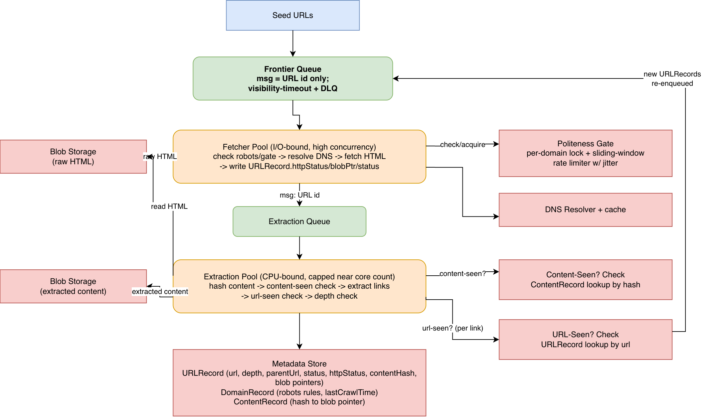

# Web Crawler at Scale

Confirmed on multiple Glassdoor reviews as a Temporal system-design round question
("web crawler at scale"). This writeup stays generic — distributed queues, worker
pools, rate limiters, schedulers — as the underlying pattern any orchestration
layer (hand-rolled or a workflow engine) would need to implement.

---

## 1) Clarification Questions (FR → NFR)

**Functional Requirements (FR)**

1. What's the crawl's end purpose — search-engine indexing, or bulk content
   extraction (e.g. training data)? This changes what "done" means: an
   indexing crawl recrawls forever; an extraction job has a deadline and can
   stop.
2. Is this a general web-wide crawl or scoped to a known set of seed domains?
3. Do we need to respect `robots.txt` and per-host politeness (assume yes for
   any production crawler)?
4. Is content freshness (recrawl) in scope, or is this a one-time crawl?
5. Do we need near-duplicate detection (mirrors/syndicated content, templated
   pages that differ only in boilerplate) or just exact duplicate detection?

**Non-Functional Requirements (NFR)**

1. What scale — millions or billions of pages? Is there a completion
   deadline, or is this an ongoing crawl?
2. What crawl rate per domain is acceptable (politeness budget)? ~1
   request/second/domain is the practical default absent other guidance.
3. Extensibility: should the architecture support adding new content types
   (PDF, images) without a redesign?
4. Fault tolerance: what happens to in-flight work when a worker dies mid-fetch?

---

## 2) Functional Requirements (FR)

- Given a set of seed URLs, discover and fetch reachable pages.
- Respect `robots.txt` and per-host rate limits (politeness).
- Extract content from each page and store it.
- Avoid re-discovering the same URL redundantly, even though it may be
  linked from many different pages.
- Avoid storing/re-processing duplicate content served at different URLs.
- Extract outbound links and feed them back into the crawl.
- Track why a URL wasn't processed (disallowed by robots, HTTP error,
  duplicate, depth limit) — not just silently drop it.
- (Optional, if freshness is in scope) Periodically recrawl pages based on
  observed change frequency.

---

## 3) Non-Functional Requirements (NFR)

- Scalable to billions of pages via horizontal worker scaling.
- Fault tolerant: a crashed worker must not lose progress or corrupt state.
- Polite: never overload a single host regardless of overall crawler throughput.
- Efficient: state a measurable completion target (e.g. "crawl N pages in
  under 5 days") rather than an open-ended "be fast" — this gives the BOTE
  math in §4 something concrete to validate against.
- Extensible: new content types / parsing rules addable without core redesign.
- Priority-aware (if freshness/ongoing crawl is in scope): important/high-value
  pages crawled before low-value ones.

---

## 4) Back-of-the-Envelope (BOTE) Calculations

Example: 10B pages, 5-day completion target.

- Assume average page transfer size 2 MB (includes inline resources; the
  HTML alone is typically much smaller, ~30 KB — 2 MB is a worst-case
  bandwidth planning number).
- A network-optimized instance (e.g. 200 Gbps class) can theoretically push
  200 Gbps / 8 bits/byte / 2 MB/page ≈ 12,500 pages/sec — but only ~30% of
  that is realistically usable once DNS resolution, rate limiting,
  politeness, and retries are accounted for, giving ≈ 3,750 pages/sec/machine.
- 10B pages / 3,750 pages/sec ≈ 30.9 days for a single machine →
  30.9 / 8 machines ≈ 3.9 days, under the 5-day target.
- This aggregate throughput is compatible with a strict 1 req/sec/domain
  politeness limit because the crawl spans millions of distinct domains in
  parallel — no single domain is ever the throughput bottleneck; the
  aggregate across all domains is.
- URL discovery: assume 10B pages surface ~30B distinct discovered URLs
  (many pages link to each other and to pages never crawled) — the URL
  table and its dedup index must be sized for this larger number, not just
  the page count.

If storage cost (not completion time) is the driving question instead:
assuming 500 KB average HTML-only page size, 1B pages/month → 500 TB/month;
at 5-year retention → 30 PB total.

---

## 5) Core Data Entities

Traced from the actual read/write pattern in the pipeline (§8), not
independently invented — every field below has a specific producer and
consumer stage.

- **URLRecord** (one row per _distinct discovered URL_, keyed by URL —
  inserted exactly once regardless of how many parent pages link to it):
  `url`, `domain` (stored, not derived-on-read, because the Domain-table
  join and the scheduler's per-domain queries both need it indexed — this
  is a real query need, unlike a routing-only hash that's cheaper to
  recompute than store), `depth` (link-hop count from seed; a seed URL is
  depth 0), `parentUrl` (which page first discovered it — useful for
  debugging crawl paths and trap diagnosis), `status`
  (`PENDING` / `FETCHED` / `PROCESSED` / `SKIPPED_ROBOTS` /
  `SKIPPED_DEPTH_LIMIT` / `DUPLICATE_CONTENT` / `FAILED`), `httpStatus`
  (last fetch's HTTP status — distinguishes "never tried" from "tried and
  got a 404/5xx," which `status` alone doesn't capture), `rawHtmlBlobPointer`,
  `contentHash` (set once the extraction stage runs), `discoveredAt`,
  `fetchedAt`. If freshness is in scope, additionally: `nextCrawlAt`,
  `observedChangeFrequency` — kept on this same record rather than a
  separate table, since they're 1:1 with the URL, not an independent concept.
- **DomainRecord** (one row per domain): `domain`, `robotsTxtRules`,
  `robotsTxtFetchedAt`, `lastCrawlTime`, `crawlDelaySeconds`. This is the one
  piece of state that makes politeness possible — fetcher workers themselves
  stay stateless between calls; the statefulness lives entirely in this
  shared coordination row, consulted and updated once per fetch.
- **ContentRecord** (one row per _distinct piece of content_, keyed by
  content hash — not per URL, since many URLs can resolve to byte-identical
  content and only one copy should ever be stored): `contentHash`,
  `extractedContentBlobPointer`, `firstSeenUrl`. A URLRecord with a
  `contentHash` that already has a ContentRecord is a duplicate: skip
  storing the content again, but the URL itself is still marked
  `DUPLICATE_CONTENT` rather than discarded, so it's not endlessly
  re-discovered from other pages that still link to it.

Two separate dedup checks fall naturally out of this model, and both are
required — they catch different things:

1. **URL-seen check** (before inserting a URLRecord): has this exact URL
   already been discovered? Prevents re-inserting the same URL every time a
   different page links to it.
2. **Content-seen check** (after fetching, before storing): does this URL's
   content hash already have a ContentRecord? Prevents storing the same
   content twice when it's served under a different URL entirely (mirrors,
   `example.com` vs `www.example.com`, syndicated articles).

---

## 6) System Interfaces

**External, operator-facing:**

- **Input**: seed URLs to start crawling from.
- **Output**: extracted content (and, if this is an indexing crawler,
  outbound-link metadata for ranking).
- `GET /crawl-jobs/{jobId}/status` — live counts by `URLRecord.status`.
- `POST /crawl-jobs/{jobId}/pause` / `/resume`.

**Internal write paths** (not exposed externally — these are the actual
data-flow contracts between pipeline stages, listed so entity ownership is
unambiguous):

- Fetcher stage → writes `URLRecord.{httpStatus, rawHtmlBlobPointer,
fetchedAt, status}` and `DomainRecord.lastCrawlTime`.
- Extraction stage → writes `URLRecord.{contentHash, status}`,
  `ContentRecord` (on a genuinely new hash), and inserts new child
  `URLRecord`s after the URL-seen check.
- Scheduler (if freshness in scope) → reads `URLRecord.nextCrawlAt`, writes
  `URLRecord.{status=PENDING, nextCrawlAt, observedChangeFrequency}` and
  re-enqueues to the Frontier Queue.

---

## 7) Simple Design (Single Worker)

```
1. Take seed URL from frontier and resolve IP via DNS
2. Fetch HTML from external server using IP
3. Extract content from the HTML
4. Store the content
5. Extract linked URLs from the page and add them to the frontier
6. Repeat steps 1-5 until all URLs have been crawled
```

```
[Seed URLs] --> [Frontier Queue] --> [Crawler: fetch+extract] --> [Storage]
                                                            |
                                                            v
                                                 [extracted links back
                                                  into Frontier Queue]
```

---

## 8) Enriched Design (Distributed)



Editable source: [`diagrams/enriched_architecture.drawio`](diagrams/enriched_architecture.drawio)

Break the crawler into pipelined, independently-scalable stages so a failure
in one stage is retryable without losing progress on the rest of the data.
The two stages also have fundamentally different resource profiles, which is
the real reason they're separate worker pools rather than one combined
"crawler" process: fetching is I/O-bound (mostly waiting on the network, so
concurrency can safely exceed core count), while extraction is CPU-bound
(parsing/hashing, where concurrency is capped near core count and more
threads past that point doesn't help). Combining them into one pool would
force both to share a sizing knob that's wrong for one of the two.

**End-to-end flow, traced against the entities in §5:**

1. Seed URLs are inserted as `URLRecord`s (`status=PENDING`, `depth=0`,
   `parentUrl=null`) and their ids pushed onto the **Frontier Queue**. The
   message payload is only a URL id — never the raw HTML itself; queues
   aren't built for large payloads and it's expensive to carry HTML through
   one.
2. A **Fetcher-stage worker** pulls a message, looks up the `URLRecord` and
   its `domain`'s `DomainRecord`.
   - If `robotsTxtRules` hasn't been fetched yet for this domain, fetch and
     cache it now — a one-time cost per domain, avoiding a repeat robots.txt
     download on every URL under that host.
   - If the URL is disallowed by the cached rules: mark
     `status=SKIPPED_ROBOTS`, ack the message, done — no fetch attempted.
   - If the domain's politeness gate (`lastCrawlTime` + `crawlDelaySeconds`)
     hasn't elapsed: defer the message (extend its visibility) rather than
     fetching now or dropping it.
   - Otherwise: resolve DNS (cached), fetch the HTML, write it to blob
     storage, set `URLRecord.{httpStatus, rawHtmlBlobPointer, fetchedAt,
status=FETCHED}`, update `DomainRecord.lastCrawlTime`, and hand the id
     to the extraction queue.
3. An **Extraction-stage worker** pulls a message, reads the raw HTML from
   blob storage, computes its content hash.
   - **Content-seen check**: if a `ContentRecord` already exists for this
     hash, mark `URLRecord.status=DUPLICATE_CONTENT` and stop — the content
     itself is never re-stored, but the URL stays a first-class discovered
     record (so it isn't endlessly re-inserted from other linking pages).
   - Otherwise: extract content and outbound links, write the content to
     blob storage, create the `ContentRecord`, mark
     `URLRecord.status=PROCESSED`.
   - For each extracted link: run the **URL-seen check** (does a
     `URLRecord` already exist for this exact URL?). If new: compute
     `depth = parentDepth + 1`; if `depth` exceeds the trap threshold, mark
     `status=SKIPPED_DEPTH_LIMIT` and don't enqueue; otherwise insert the
     `URLRecord` and push its id onto the Frontier Queue.

**Queue choice.** Three real options, and the choice is coupled to how
politeness gets enforced — it isn't an independent decision:

- **Managed message queue (e.g. SQS)**: visibility-timeout semantics
  (message becomes invisible once pulled, but isn't deleted until the
  worker confirms success) plus automatic dead-letter-queue support after N
  failed attempts. Gives crash recovery for free — a crashed worker's
  message reappears after the timeout for another worker to pick up, no
  custom recovery logic needed. The queue has no concept of message
  ordering or grouping by domain, so it carries zero politeness guarantee
  of its own — politeness must be enforced entirely by application-level
  logic (the lock + rate-limit counter below). This is the simplest option
  operationally: no cluster to run, no partition/ordering model to design,
  pay-per-request scaling.
- **Log-based queue, partitioned by domain (e.g. Kafka, or a managed
  equivalent like Amazon MSK)**: partitioning by domain key means every
  URL for a given domain always lands on the same partition, and only one
  consumer ever reads a given partition at a time. This gives
  single-consumer-per-domain and in-order-per-domain delivery _structurally_,
  for free — the consumer for a domain's partition simply knows nothing
  else is concurrently touching that domain, so it can space out requests by
  `crawlDelaySeconds` without a separate lock at all. The trade-off is
  conceptual, not operational: MSK removes the "run your own brokers"
  burden, but partition-count and partition-key design are still real
  decisions to get right, and crash recovery is offset-based (a crashed
  consumer resumes from its last committed offset) rather than
  per-message visibility timeouts.
- **The metadata store itself as the queue** (`SELECT ... FOR UPDATE SKIP
LOCKED` against `URLRecord` filtered on `status = 'PENDING'`): since
  `URLRecord.status` already tracks pipeline position, there's no separate
  queue system at all — "dequeue" is a `SELECT`, "requeue after crash" is a
  stale `IN_PROGRESS` row resetting after a timeout, "prioritize" is an
  `ORDER BY`, and "respect politeness" is a `WHERE domain NOT IN (...)`
  predicate against `DomainRecord` — no external lock service needed, for
  the same structural reason as the Kafka option, but expressed in SQL
  instead of partitioning. This is the simplest option architecturally (one
  fewer system to operate) but doesn't scale the same way a purpose-built
  queue does: high-throughput `SKIP LOCKED` polling puts real write
  contention on the same table the fetch/extract stages are already writing
  to.

**Preferred:** SQS-style for most designs — it's the default precisely
because it makes the fewest structural assumptions (no partitioning model,
no shared table to contend on) and politeness lives in one clearly-owned
place (the lock below) rather than being smeared across a queue's
partitioning scheme. Reach for Kafka/MSK specifically when domain-partitioned
ordering is valuable enough to justify designing around it — at that point
the lock below can be dropped entirely, since the partitioning already
provides the guarantee. Reach for DB-as-queue at small-to-moderate scale
where "one fewer system to run" outweighs eventual dequeue-throughput
contention — the doc's own BOTE numbers (§4, thousands of pages/sec) are
past the point where this is likely to hold up without further sharding.

**Politeness enforcement (for the SQS-style default):** an atomic per-domain
lock (e.g. a distributed `SET NX` with a TTL matching `crawlDelaySeconds`)
acquired before crawling a domain; a worker that can't acquire the lock
defers the message instead of crawling. Rate limiting beyond the lock uses a
shared, centralized counter (sliding window per domain per second), with
**jitter** added to retry delays — without jitter, many workers deferred on
the same domain will all retry at the same instant when the window resets,
and only one will succeed, repeating the storm.

This lock + counter is the runtime-check equivalent of what Kafka's
domain-partitioning or the DB-as-queue's `WHERE` clause give you
structurally (see above) — it's the right default specifically because it
doesn't require committing to either of those two queue technologies. If a
shared lock/counter dependency itself becomes the bottleneck at very large
scale, migrating to structural enforcement (Kafka partitioning, or an
equivalent per-host static queue-to-worker binding) removes the runtime
check entirely — worth it only once that dependency is the proven
bottleneck, not by default.

---

## 9) Deep Dives (Problem → Solutions → Preferred → Trade-offs)

### 9.1 Politeness at Scale

- **Problem:** many workers crawling in parallel must never let two of them
  hit the same host concurrently, and must respect a `Crawl-delay` directive
  between requests to the same host.
- **Solutions:** per-domain distributed lock + rate-limit counter (§8) vs.
  structural static host→queue→worker binding (§8's alternative) vs. no
  coordination at all (broken — the first thing to rule out).
- **Preferred:** the lock + counter approach for most designs — it's simpler
  to reason about and to tune (delay is just a config value on
  `DomainRecord`), and jitter on retries is a real production concern worth
  calling out proactively.
- **Trade-off:** the lock/counter dependency must scale with domain count and
  be highly available, or politeness breaks system-wide; the structural
  alternative avoids this dependency but needs the host→queue mapping kept
  consistent across distributed crawl servers instead.

### 9.2 Crawler Traps

- **Problem:** a page can link to itself or generate an effectively infinite
  chain of URLs (e.g. a calendar page cycling `?date=2024-01-01`, `?date=
2024-01-02`, ...), trapping a crawler indefinitely.
- **Solutions:** cap max URL length vs. cap max crawl depth (link-hops from
  seed, not path segments — tracked via `URLRecord.depth`).
- **Preferred:** depth capping. URL-length capping only catches traps whose
  URLs literally grow in string length; a trap generating many distinct,
  same-length URLs (the date-cycling example) sails through a length cap
  while still being an infinite space. Depth naturally bounds both shapes
  since it counts hops, not URL structure. A threshold around 15-20 is a
  reasonable default. `URLRecord.parentUrl` doubles as a diagnostic trail —
  once a domain shows an unusually large count of `SKIPPED_DEPTH_LIMIT`
  rows, walking `parentUrl` back from a few of them quickly reveals the
  trap's shape.
- **Trade-off:** depth capping can prematurely stop crawling a legitimately
  deep, valuable site (e.g. a forum with genuinely deep thread nesting).
  Neither cap alone is complete — manual identification/blacklisting remains
  necessary for edge cases either way.

### 9.3 URL Prioritization

- **Problem:** not every discovered URL is equally worth crawling first.
- **Solutions:** multiple priority-tagged queues, workers polling
  high-priority queues first, vs. a continuous priority score (PageRank-like)
  computed per URL and used to bias a weighted queue selector.
- **Preferred:** discrete priority queues for most designs — it reuses the
  same queue primitive already in the architecture rather than introducing a
  separate scoring component. Reach for a continuous scoring model only if
  priority genuinely needs to be a computed, continuously-updated value
  rather than a small fixed number of tiers.
- **Trade-off:** discrete tiers are simpler but coarser-grained; a continuous
  score gives finer ordering but adds a component that has to be computed
  and kept current.

### 9.4 Duplicate Detection

- **Problem:** identical content can be served at different URLs (mirrors,
  `example.com` vs `www.example.com`, syndicated content), and the same URL
  can be discovered from many different parent pages before it's crawled.
- **Solutions:** for URL-seen and content-seen checks (§5) — a Bloom filter
  vs. an indexed lookup on the `URLRecord`/`ContentRecord` key.
- **Preferred:** an indexed DB lookup — once a metadata store is already in
  the critical path for tracking fetch state anyway, a lookup there is
  simpler than also maintaining a separate probabilistic structure that can
  false-positive. A Bloom filter earns its keep specifically when
  cardinality gets large enough that even an indexed lookup becomes costly
  (billions of rows, very high QPS) — at that point a two-level check (fast
  in-memory Bloom filter first, DB lookup as the authoritative fallback on a
  possible-hit) is the natural design.
- **Trade-off:** starting with the DB index is the simpler default; adding
  the Bloom-filter front layer is a scale-driven optimization, not a
  day-one requirement.
- **Extension — near-duplicate detection:** exact content-hash matching
  (`ContentRecord.contentHash`) only catches byte-identical content. Mirrors
  or syndicated content with minor per-page differences (a tracking
  parameter injected into otherwise-identical HTML, a templated page with
  boilerplate navigation but different visible text) won't match a plain
  hash. A locality-sensitive hash (simhash) computed alongside the exact
  hash catches these — worth raising specifically if the interviewer pushes
  on dedup quality beyond exact matches, but it's an addition on top of the
  exact-hash check (§5), not a replacement for it: exact matching is cheaper
  and should run first.

### 9.5 Scaling to the Target Throughput

- **Problem:** a single crawler machine can't hit billions of pages within
  any reasonable deadline.
- **Solutions:** reason from real cloud instance bandwidth to size the
  fetcher fleet (§4's BOTE math), then partition the URL space across that
  fleet via consistent hashing so servers can be added/removed without a
  full reshuffle. Size the extraction fleet independently — dynamically,
  based on the depth of the extraction queue, rather than 1:1 with fetcher
  count, since the two pools have different resource profiles (§8) and
  therefore different scaling ratios.
- **Preferred:** all three together — bandwidth math answers "how many
  fetcher machines," consistent hashing answers "how do they divide the
  work," and independent extraction-pool sizing prevents the CPU-bound stage
  from either starving behind or over-provisioning relative to the I/O-bound
  one.
- **Trade-off:** BOTE math is a communication tool for reasoning through the
  problem in an interview, not a capacity-planning guarantee — real sizing
  needs load testing.

### 9.6 DNS as a Hidden Bottleneck

- **Problem:** DNS resolution is easy to overlook since tools like `curl`
  handle it transparently, but at scale it isn't free — DNS response times
  of 10-200ms per lookup, and early crawler research found DNS lookups
  accounting for up to 70% of a thread's elapsed time before a custom
  resolver was built.
- **Solutions:** DNS caching (baseline, non-negotiable at any scale) vs.
  multiple DNS providers round-robin'd to distribute load and avoid
  third-party rate limits.
- **Preferred:** caching as the default; add a second provider only once a
  single provider's rate limits become the actual binding constraint —
  introducing a second provider prematurely adds operational complexity
  (cache consistency across providers, provider-specific failure handling)
  without a proven need.
- **Trade-off:** none beyond ordering — caching is unconditionally worth
  doing; multiple providers is conditional on hitting a real limit.

### 9.7 Continual Updates / Freshness (Optional Extension)

- **Problem:** a one-time crawl design has no mechanism for keeping data
  current; a search-engine-style crawler needs ongoing recrawl.
- **Solutions:** recrawl based on observed update history, prioritizing
  important pages more frequently — implemented as a dedicated **URL
  Scheduler** component that owns recrawl policy, decoupled from the
  fetch/extraction pipeline. Rather than the extraction stage enqueueing
  recrawl work directly, it just updates `URLRecord.observedChangeFrequency`
  (by comparing a page's new content hash against its previous one); the
  Scheduler separately scans `URLRecord.nextCrawlAt` and re-enqueues due
  URLs, computing the next interval from the observed frequency.
- **Preferred:** the Scheduler as a separate component — this decouples "what
  got discovered/changed" from "what gets crawled next," so the recrawl
  policy can change without touching the fetch/extract pipeline at all.
- **Trade-off:** this component is unnecessary for a one-time crawl and adds
  real complexity (scoring logic, its own scheduling loop) — build it only
  if the FR clarification in §1.1 confirms freshness is actually in scope.
