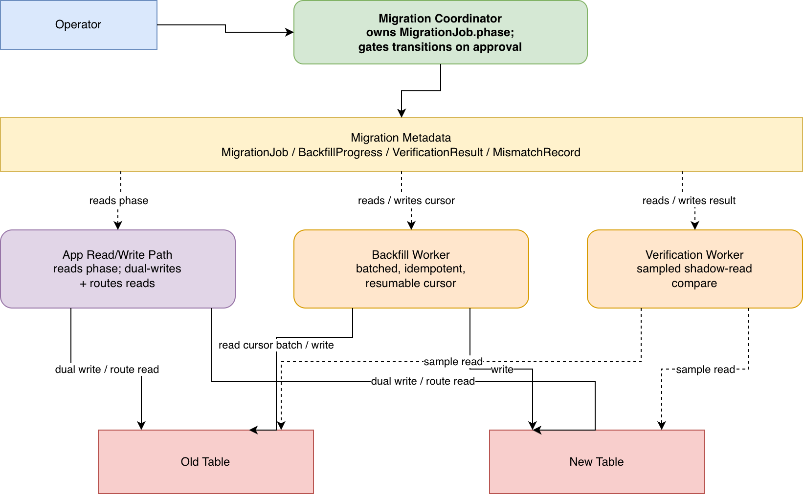

# Zero-Downtime Database Migration

---

## 1) Clarification Questions (FR → NFR)

**Functional Requirements (FR)**

1. Is this a schema migration (e.g. column type change), a storage-engine migration
   (e.g. moving to a new datastore or table design), or both?
2. Is the dataset actively read/written by production traffic during the migration
   (i.e. does it need to stay zero-downtime), or is a maintenance window acceptable?
3. Do we need to support rollback at every phase, or only up to a defined point of
   no return?
4. Do all writers go through a single service's API, or does anything write to
   this table/store directly (shared DB, another service's direct connection)?
   This determines whether migration can happen at the domain/API layer (reuse
   business logic, dual-invoke) or must happen at the storage layer
   (CDC/trigger-based replication).

**Non-Functional Requirements (NFR)**

1. What is an acceptable staleness window between old and new stores during
   dual-write (seconds? sub-second?).
2. What percentage of read/write traffic can we afford to double during dual-write
   (capacity headroom on both stores)?
3. Is there a compliance/audit requirement to retain the old data for N days after
   cutover before deletion?
4. What triggers an automatic rollback (data-mismatch rate above threshold? error
   rate spike?) vs. requiring a human decision?

---

## 2) Functional Requirements (FR)

- Introduce a new schema/store without breaking existing readers/writers (expand).
- Backfill existing data into the new store without blocking production traffic.
- Keep old and new stores consistent while both are live (dual-write).
- Verify correctness before trusting the new store (shadow-read comparison).
- Cut traffic over to the new store, first for reads, then for writes.
- Remove the old schema/data once the new path is proven stable (contract).
- Support rollback at any phase prior to the old data being deleted.

---

## 2.5) Migration Granularity Decision

Whether to migrate at the **API/domain layer** or the **storage/table layer**
is a decision driven by write-path topology (§1, Q4), not an assumption:

- **If a single service's API is the only write path**: prefer **API/domain-layer
  migration** — dual-invoke old and new write logic per request (each side
  responsible for its own storage shape), backfill by replaying old data
  through the same domain constructors the live write path already uses, and
  verify by comparing business-level read results rather than raw rows. This
  avoids schema-transform complexity entirely for incompatible shapes or
  fan-out (one old row mapping to multiple new tables), since each side's
  domain logic independently builds its own correct representation.
- **If writers connect directly to the datastore** (shared DB, other services
  bypassing the API) and can't be intercepted: fall back to **table-level
  replication via CDC** (preferred over DB triggers — no added write-path
  latency, no logic coupled into the database) with an explicit, bidirectional
  **transform function** shared by dual-write and backfill.
- The remainder of this document (§7–§9) describes the table-level/CDC path,
  since it is the harder case requiring more machinery. API-layer migration is
  the simpler, preferred path whenever the write-path topology allows it.

---

## 3) Non-Functional Requirements (NFR)

- Zero user-visible downtime and no error-rate regression during the transition.
- Durable progress: a crashed backfill process must resume, not restart.
- Bounded staleness during dual-write; bounded blast radius if one write of a pair fails.
- Auditable: every phase transition (start backfill, cutover, rollback) is
  observable and can be gated by a human approval.
- Reversible up until the old data is deleted; irreversibility must be an explicit,
  visible step — not implicit.

---

## 4) Back-of-the-Envelope (BOTE) Calculations

- Example dataset: 500M rows, 1 KB avg row size → ~500 GB to backfill.
- Backfill throughput target: complete within a maintenance-adjacent window (e.g.
  24–48h) without saturating prod DB — batch size ~1k–10k rows/job, paginated by
  primary-key range, parallelism capped by the target store's write-capacity
  budget (e.g. a few hundred concurrent batch workers × 1k rows/batch).
- Dual-write window: expect to run for days-to-weeks depending on bake-period
  requirements; both stores must have capacity headroom for 2x the affected
  write path during this window.
- Verification: shadow-read comparison sampled (e.g. 1–5% of read traffic) rather
  than 100%, to bound the added read-path latency/cost.
- Schema-change lock duration: any DDL statement that takes an exclusive table
  lock must complete in low hundreds of milliseconds to a couple of seconds at
  most — past that, queued application queries pile up behind it and the "zero
  downtime" property breaks at the DDL step, not just at the data-migration step.

---

## 5) Core Data Entities

- **MigrationJob**: `jobId`, `sourceTable`, `targetTable`, `phase` (BACKFILL /
  DUAL_WRITE / VERIFY / CUTOVER_READS / CUTOVER_WRITES / CONTRACT / ROLLED_BACK),
  `startedAt`, `cursor` (last-migrated primary key, for resumability).
- **BackfillProgress**: `jobId`, `lastCompletedKeyRange`, `rowsMigrated`,
  `rowsFailed` (for retry/reconciliation).
- **VerificationResult**: `jobId`, `sampledKey`, `oldValueHash`, `newValueHash`,
  `match` (bool), `comparedAt`.
- **MismatchRecord**: `jobId`, `key`, `mismatchType` (`OLD_ONLY` / `NEW_ONLY` /
  `VALUE_DIFF`), `diffDetails`, `resolved` (bool), `requiresApproval` (bool —
  true once past CUTOVER_WRITES for repairs that write into the old store) —
  feeds a reconciliation job or alert; `mismatchType` determines the repair
  action (§9.7).
- **ReconciliationAuditEntry**: `jobId`, `key`, `direction` (`OLD_TO_NEW` /
  `NEW_TO_OLD`), `previousValue`, `newValue`, `appliedAt`, `approvedBy`
  (nullable — set only for gated repairs) — an append-only log of every
  write reconciliation actually made, scoped to just the keys it touched
  (not a full-table snapshot), so a bad repair can be targeted-reverted
  (§9.7).
- **CutoverApproval**: `jobId`, `approvedBy`, `approvedAt`, `bakePeriodEndsAt`.

---

## 6) System Interfaces

**Control-plane APIs (operator-facing):**

- `POST /migrations/{jobId}/start` → kicks off the backfill + dual-write phase.
- `POST /migrations/{jobId}/approve-cutover` → unblocks the paused migration
  process, permitting it to flip read (and later write) routing.
- `POST /migrations/{jobId}/approve-reconciliation` → applies pending
  `MismatchRecord` repairs flagged `requiresApproval=true` (repairs writing
  into the old store, post-CUTOVER_WRITES); required because auto-applying
  reconciliation in that direction risks propagating bad data into the
  fallback store (§9.7).
- `POST /migrations/{jobId}/rollback` → reverts routing flags to the old store;
  only accepted while `phase` is before CONTRACT.
- `GET /migrations/{jobId}/status` → current phase, progress %, mismatch count,
  pending-approval reconciliation count.

**Data-plane (write path instrumentation):**

- Application write path checks `MigrationJob.phase` (via a lightweight config/flag
  lookup, not a per-request call to the migration coordinator) to decide: write
  old only / write both / write new only.

---

## 7) Simple Design (Single Table, Single Writer)

```
[App Write Path] --> [Old Table]

                (migration triggered)

[App Write Path] --> [Old Table]
                  \-> [New Table]   (dual-write)

[Backfill Process] --> reads Old Table in key-range batches --> writes New Table
```

**Flow:** expand schema → backfill in the background while dual-write covers new
writes going forward → verify → cut reads over → cut writes over → delete old table.

---

## 8) Enriched Design



Editable source: [`diagrams/enriched_architecture.drawio`](diagrams/enriched_architecture.drawio)

**Components & Flow (four phases):**

1. **Dual writing.** Create the new table. Every new write goes to both the old
   and new tables. Ramp up the write-duplication percentage gradually while
   watching operational metrics, rather than flipping it on for 100% of traffic
   at once — this bounds the blast radius if the new write path has an
   undiscovered bug. Existing rows are backfilled by the same continuous
   reconciliation mechanism used throughout the migration (§9.7) — a
   scheduled sweep over key ranges that copies/repairs whatever is missing
   or diverged in the new store, plus a lazy variant that copies a row over
   as a side effect whenever it's touched by a normal update. Backfill isn't
   a separate one-shot mechanism from reconciliation; it's reconciliation's
   forward sweep, so there's no strict ordering requirement between
   "turn on dual-write" and "start reconciliation" — reconciliation being
   continuous means it self-heals any row missed due to a race between the
   two, regardless of which started first. Dual-write is still turned on
   first in practice, though, purely for efficiency: it's a cheap
   synchronous extra write on the hot path, and doing so shrinks
   reconciliation's ongoing job down to "occasional missed/failed writes"
   instead of "keep re-scanning the entire live write stream forever" —
   without dual-write active, reconciliation alone would have to carry that
   full ongoing load indefinitely, not just close the historical backlog.
   The reconciliation sweep persists its progress cursor
   (`BackfillProgress.lastCompletedKeyRange`) so a crash resumes from the
   last completed batch instead of restarting from row zero, and its writes
   are idempotent (upsert, not insert) because a batch may be retried —
   though the upsert must not blindly overwrite a newer live-written value
   with a stale one from the sweep (favor "insert if absent" or a
   recency-checked update, not an unconditional overwrite). At very large
   scale, finding "which rows still need migrating" by querying the live
   table directly is itself expensive — an offline batch job against a read
   replica or snapshot avoids adding scan load to the production write path.
2. **Cutting over reads.** Once the historical backlog is reconciled and
   dual-write's ongoing reliability is confirmed (§9.2 — its retry/failure
   path is actually catching and repairing misses, not just assumed to be
   working), start reading from the new table — but only after verifying
   it's safe. "Reconciliation looks converged right now" is a snapshot-in-time
   signal and isn't sufficient on its own; dual-write being confirmed
   reliable is what says new writes will keep landing correctly going
   forward, which is the actual precondition for trusting reads against new.
   Run both the old and new read paths side-by-side for a sample of requests,
   diff the results, and alert on mismatches (`VerificationResult`,
   `MismatchRecord`) instead of trusting row counts alone. Only after this
   comparison passes consistently does the read path fully switch to the new
   table.
3. **Cutting over writes.** Reverse the write order: instead of "write old, copy
   to new," writes now go to the new table first and are archived to the old
   table second. This is done incrementally, one write-path/code-path at a time,
   not as a single big-bang change — the more surface area a single change
   touches, the higher the odds of missing an edge case. Comparison experiments
   (same mechanism as the read cutover) keep flagging any divergence introduced
   by this reordering.
4. **Removing old data.** Once no code path depends on the old table anymore,
   stop writing to it, then delete it — including a final job to catch any
   rows the incremental process missed. This is the only genuinely irreversible
   step; everything before it can still fall back to the old table as long as
   it's kept in sync.

**Schema-change safety (a prerequisite to phase 1, not a separate phase):** the
DDL statement that creates the new table/columns must itself avoid taking a
long-held exclusive lock on a hot table — an `ALTER TABLE ... ADD COLUMN ...
NOT NULL DEFAULT` style statement that rewrites every row under one lock can
stall the app just as effectively as a botched cutover. Bound this by capping
how long any single migration statement is allowed to hold a lock or run
(reject and retry later rather than block indefinitely), and by keeping each
schema-changing transaction small enough that its lock duration stays in the
"queries queue for a moment" range, not the "app goes unresponsive" range.

---

## 9) Deep Dives (Problem → Solutions → Preferred → Trade-offs)

### 9.1 Backfill Durability & Idempotency

- **Problem:** A backfill touching hundreds of millions of rows will span
  process restarts/deploys; naive scripts restart from zero and risk
  double-processing.
- **Solutions:** re-derive "what's left to migrate" from scratch on every run
  (correct but wasteful and slow at scale) vs. persist an explicit progress
  cursor (primary-key range already completed) that a restarted process resumes
  from.
- **Preferred:** persisted cursor plus idempotent (upsert) batch writes. The
  cursor answers "where do I resume," and idempotency answers "what if this
  exact batch runs twice" — both are needed together, since a crash can happen
  mid-batch (cursor not yet advanced) as easily as between batches.
- **Trade-off:** upsert semantics cost a bit more per write than a bare insert,
  and the progress-tracking store becomes something that itself needs to be
  durable and consistent with the actual migration state.

### 9.2 Dual-Write Consistency

- **Problem:** No cross-store transaction exists; one write of the pair can fail
  while the other succeeds, silently diverging the two stores.
- **Solutions:** best-effort dual-write with no compensation (accept drift,
  catch it later in verify) vs. retry-with-backoff on the second write vs.
  explicit reconciliation (log the divergent record for a downstream repair job
  to fix, rather than either blocking the request or silently dropping it).
- **Preferred:** retry the second write with bounded backoff; if it still fails,
  don't fail the whole request (the old store already has the write) — instead
  flag the record in `MismatchRecord` so the ongoing verification pass catches
  and reconciles it. This trades a short window of drift for keeping the user
  request itself fast and non-blocking.
- **Trade-off:** true atomicity across two independent stores is not achievable
  without a distributed transaction (which most designs deliberately avoid for
  latency reasons). The goal here is making the failure _visible and
  recoverable_, not physically atomic — worth stating explicitly, since an
  interviewer may probe whether the candidate understands this isn't "solved,"
  just bounded.
- **Interaction with read cutover:** the "retry then flag for later
  reconciliation" approach above is only safe as long as a read fallback to
  the old store still exists. Once reads have cut over (§9.4), a failed
  second write means the new store is now missing or stale for that specific
  record — a read hitting the new store for that key returns wrong or
  missing data, and the async, sampled verification pass isn't guaranteed to
  catch it before another read does. Two ways to close this once reads are
  on the new store: make the second write synchronous with bounded retries
  for that request (closes the gap, adds request latency and a new blocking
  failure mode to handle); or keep the write async but have the read path
  check for an open `MismatchRecord` on that key and fall back to the old
  store for just that record until it's reconciled (no added write latency,
  but the read path now has an extra per-key check). Prefer the second
  approach unless write-path latency is already tightly bounded elsewhere,
  since it avoids adding blocking behavior to every dual-write.

### 9.3 Verification Before Trust

- **Problem:** Cutting over reads/writes based on backfill "looking done"
  without comparison is a common real-world cause of migration incidents —
  row counts matching doesn't mean row _contents_ match.
- **Solutions:** trust aggregate counts/checksums vs. per-record shadow-read
  comparison (read both stores for the same key, diff the actual values, alert
  on mismatch).
- **Preferred:** sampled shadow-read comparison (e.g. 1–5% of read traffic) run
  continuously through the dual-write and read-cutover phases, not just once
  right before cutover — mismatch rate becomes a first-class signal gating the
  cutover approval, not a one-time checkbox.
- **Trade-off:** running the comparison on 100% of traffic doubles read cost and
  adds latency to every request; sampling trades verification completeness for
  cost, so the sample rate and the acceptable mismatch threshold must both be
  stated as explicit design decisions, not left implicit.

### 9.4 Cutover Ordering (Reads Before Writes)

- **Problem:** Which of reads/writes should switch first?
- **Solutions:** cut writes first (risky — the new store's read path is still
  unproven under real load) vs. cut reads first, then writes vs. cut both
  simultaneously (fastest, but collapses all risk into one step).
- **Preferred:** reads first — this validates the new store under real read
  load while writes are still safely dual-written to both stores as a
  fallback. Only after reads are proven stable do writes cut over, and when
  they do, the write _order_ flips too (write new-first, old-second) so the
  old store never silently falls behind while anything might still be reading
  it as a fallback.
- **Trade-off:** longer overall migration timeline vs. materially lower blast
  radius per step — each cutover step independently reversible rather than one
  large irreversible jump.

### 9.5 Rollback Window & the Point of No Return

- **Problem:** Rollback must be possible for as long as feasible, but "possible
  forever" isn't free — indefinitely retaining the old store blocks cost and
  cleanup goals.
- **Solutions:** delete the old store immediately after cutover (cheap, but
  removes the safety net) vs. a fixed bake period before cleanup vs. indefinite
  retention (safe, but the migration never actually finishes).
- **Preferred:** a fixed bake period after cutover, tracked as an explicit
  scheduled step (not an ad-hoc "someone remembers to delete it later"), after
  which a cleanup job deletes old data. The design explicitly distinguishes
  "recoverable" phases (anything before this final deletion) from the one
  genuinely irreversible step — this distinction is the crux of "zero-downtime"
  actually meaning "zero-_risk_" until a deliberate, gated point, and is worth
  calling out proactively rather than waiting to be asked.
- **Trade-off:** too-short a bake period risks deleting old data before latent
  bugs surface in the new store; too-long delays cost savings and code cleanup.

**Rollback after CUTOVER_WRITES needs to distinguish two different triggers,
because "old" is not equally trustworthy in both cases:**

- **Routing rollback** (new is having an outage, high error rate, or
  performance problem, with no reason to suspect the _data_ in new is
  wrong): flipping routing back to old is safe as-is — old has been kept in
  sync (auto-applied repairs cover the expected new→old lag direction), and
  the concern here was never data correctness.
- **Correctness rollback** (new actually produced wrong data — an existence
  or value bug, not an availability problem): here, any repair that already
  auto-applied or was approved into old during the bug's active window may
  have carried the bad data along with it. Trusting old as-is is exactly
  the failure mode reconciliation risks; the recovery instead uses
  `ReconciliationAuditEntry` to identify and revert the specific
  `NEW_TO_OLD` entries applied during the affected window, before (or as
  part of) flipping routing back.
- **Trade-off:** routing rollback is instant and always safe pre-CONTRACT.
  Correctness rollback is slower — it requires identifying the affected
  window and reverting targeted audit entries rather than a single flip —
  but this is far cheaper than restoring from a full point-in-time
  snapshot, since reconciliation only ever touches the small fraction of
  keys that actually diverged, not the whole table.

### 9.6 Schema-Change Lock Safety

- **Problem:** Even before any data migration begins, the DDL statement that
  adds a column or changes a type can itself take the outage — an exclusive
  table lock held for the duration of a slow statement blocks every other
  query queued behind it, and unlike the multi-hour data migration, this
  failure mode shows up as a hard app outage within seconds.
- **Solutions:** run schema changes "as is" and hope they're fast (works until
  the table is large or the statement rewrites every row) vs. explicitly cap
  how long any migration statement is allowed to wait for or hold a lock
  (fail fast and retry later, rather than block indefinitely) vs. avoid
  transactions large enough to accumulate multiple locks under one commit.
- **Preferred:** enforce a hard cap on lock-wait time and per-statement
  execution time for every schema-change statement, and keep each
  schema-changing transaction scoped to a single, small statement rather than
  bundling several DDL changes into one transaction. If a statement can't
  acquire its lock or finish within the cap, it errors out and gets retried
  later instead of silently queuing every other query behind it.
- **Trade-off:** large migrations sometimes need splitting into many small
  statements/transactions to keep each one under the cap, which adds
  operational steps (more deploys, more chances for one step to fail
  partway) in exchange for guaranteeing no single step can stall the app.

### 9.7 Reconciling Existence Mismatches (Present in One Store, Absent in the Other)

**Note (applies to §2.5's API/domain-layer path):** the mechanism below is
written for the table-layer path. Under API-layer migration, reconciliation is
not eliminated but narrows considerably: instead of cross-table structural
repair (per-row existence and value diffs), it collapses to two simpler
checks keyed by domain-entity identity rather than raw row keys — (a) did a
single dual-invocation succeed on both the old and new write paths, and
(b) is historical backfill complete at the domain-object level. The
`MismatchRecord` / `ReconciliationAuditEntry` machinery below still applies,
just against domain entities instead of table rows, since each side's domain
logic already guarantees its own internal storage consistency.

- **Problem:** Verification (§9.3) as described diffs _values_ for keys that
  exist in both stores, but a distinct and equally common failure mode is a
  key existing in only one store — e.g. a backfill batch that silently
  dropped a row, a dual-write where the second write never even attempted
  (crash before the second call), or a delete on one side that never
  propagated to the other. A value-diff check that only runs "given a key
  present in both" will never even notice this class of mismatch.
- **Solutions:** rely on eventual backfill re-runs to happen to catch missing
  rows (unreliable — nothing forces a re-run, and it doesn't handle deletes)
  vs. explicit key-set reconciliation: periodically diff the _set of primary
  keys_ between old and new stores (not just values for shared keys) and
  classify each divergent key as old-only or new-only.
- **Preferred:** an explicit key-set diff job, separate from the per-key
  value comparison, run on a schedule against key ranges (not the whole
  table at once, to bound cost) using the same offline/read-replica approach
  as backfill discovery. For each divergent key:
  - **Old-only** (missing from new): this is not a new repair mechanism —
    it's backfill's own copy operation (idempotent upsert from old into new),
    just invoked out-of-band against a specific key instead of a cursor
    sweep. Backfill and old-only reconciliation are the same primitive with
    two different triggers: a forward sweep during BACKFILL, or a targeted
    re-run whenever the key-set diff finds a gap. Persistent old-only keys
    after backfill is marked complete indicate a real bug in the write path
    (something is still writing to old without dual-writing), not just a
    slow backfill.
  - **New-only** (present in new, absent from old): the reverse direction
    has no equivalent existing primitive — there's no "backfill in reverse"
    step anywhere else in this design, so this needs its own logic. It's
    also rarer and worth treating with more suspicion than old-only: it
    usually means a write reached the new store during a phase where
    dual-write should have covered both, and the old-store write silently
    failed or was skipped. Since the old store is still the source of truth
    until cutover, a new-only row should not be deleted or trusted blindly —
    check whether it's a legitimate write whose old-store leg is still
    pending versus a genuine gap, then either replay the missing old-store
    write or flag for manual review if the cause isn't clear.
  - Both cases write into `MismatchRecord` with a `mismatchType`
    (`OLD_ONLY` / `NEW_ONLY` / `VALUE_DIFF`) rather than a bare diff string,
    since the repair action differs by type — `OLD_ONLY` routes to the
    existing backfill copy path, `NEW_ONLY` routes to its own handler.
- **Trade-off:** a full key-set diff is more expensive than a sampled
  value-diff (it has to enumerate keys on both sides, not just sample), so
  it runs less frequently — e.g. once per completed key-range during
  backfill, and on a coarser schedule during steady-state dual-write —
  rather than continuously like the sampled value comparison. This means
  existence mismatches are caught with higher latency than value mismatches,
  which is an explicit trade worth calling out: value drift is bounded by
  the value-diff sample rate, existence drift is bounded by the key-set diff
  schedule, and the two are different SLAs.

**Which store is authoritative — and therefore which repair direction is
"expected" vs. "suspicious" — is derived from the current phase, not fixed:**
before CUTOVER_WRITES, old is authoritative (every write lands there
synchronously) and `OLD_ONLY` is ordinary lag that self-heals as backfill
catches up; `NEW_ONLY` in this window is the suspicious case, since nothing
should be writing to new without old also receiving it. After
CUTOVER_WRITES, this inverts: new is authoritative, `NEW_ONLY` is ordinary
lag in the new-to-old archival copy, and `OLD_ONLY` becomes the suspicious
case. The repair logic above must key off `mismatchType` **and** the
authoritative-store-for-current-phase, not `mismatchType` alone — "copy in
the phase's expected direction" auto-applies, "copy against the phase's
expected direction" is exactly the case that needs review before it's
applied, since it means something wrote (or diverged) somewhere it
shouldn't have.

**Why auto-applying every repair is dangerous once new is authoritative:**
reconciliation's job is "make the stores agree," but that is in direct
tension with rollback's need for old to remain an independent, trustworthy
copy. If new has a correctness bug (not an availability problem — an actual
bad-data bug), continuously auto-copying new→old repairs is the mechanism
that carries that corruption into the fallback store. By the time anyone
notices and wants to roll back, old may already be partially or fully
contaminated with the same bad data, which defeats the point of having a
fallback at all.

- **Preferred mitigation (no point-in-time snapshot required):** keep
  detection continuous (the diff jobs always run, so mismatches never pile
  up silently), but gate _application_ of the repair by phase and direction:
  auto-apply repairs that copy in the phase's expected direction (low risk,
  matches normal drift), but require explicit human approval via
  `POST /migrations/{jobId}/approve-reconciliation` before applying any
  repair that writes into the old store once new is authoritative (the
  dangerous direction) — this is the same operator-in-the-loop pattern the
  design already uses for `approve-cutover`, not new infrastructure. A
  spike in the number of repairs awaiting approval is itself a signal
  (something upstream broke) that a human reviewing the batch before
  approving will catch, functioning as a manual circuit breaker.
- Every applied repair (auto or approved) is written to
  `ReconciliationAuditEntry` — a small append-only log of just the keys
  reconciliation actually touched (not a full-table snapshot), recording
  the previous and new value. If a repair turns out to have propagated bad
  data, the audit log lets the specific affected keys be identified and
  reverted without restoring the whole table.
- **Trade-off:** manual gating bounds _volume and timing_ of reconciliation
  writes (a human reviewing "500 keys about to be copied new→old" catches an
  abnormal spike), but it does not bound _subtle_ corruption — a small,
  normal-looking trickle of bad values approved during a window before
  anyone noticed the bug will still land in old. The audit log is what
  makes that case recoverable after the fact (targeted revert of exactly
  those keys) without needing a full pre-cutover snapshot, at the cost of
  the revert being reactive rather than prevented up front.

### 9.8 Schema-Incompatible / Fan-Out Migrations (Table-Layer Path Only)

- **Problem:** §7–§9 assume an expand-compatible schema, where dual-write can
  copy the same payload to both tables. A real schema or storage-engine change
  (column type change, denormalization, one old row mapping to multiple new
  tables) breaks that assumption — this section only applies when §2.5 selects
  the table-layer/CDC path, since API/domain-layer migration sidesteps this
  entirely by having each side's business logic build its own correct shape.
- **Dual-write needs a transform, not a copy.** Every write to old must be
  transformed into new's shape before being written to new — e.g. old
  `amount_cents: int` → new `amount: Decimal`. Backfill's cursor sweep must
  apply the same transform, not a separate implementation, or the two can
  silently diverge from each other and produce `VALUE_DIFF` mismatches (§9.3)
  caused by implementation drift rather than a real race.
- **Verification must compare at the transformed/semantic level**, not raw
  bytes — hash-comparing an `int` against a `Decimal` directly is meaningless;
  apply the same transform to the old-side value before diffing.
- **Fan-out (one old row → N new tables) adds an atomicity problem within the
  new side.** Writing to N new tables from one old row is N writes; a partial
  failure (2 of 3 succeed) leaves new internally inconsistent before it's even
  compared against old. Wrap the N writes in a single transaction if
  co-located, or extend the retry-then-flag pattern (§9.2) to identify which
  of the N targets is missing.
- **Existence-mismatch reconciliation (§9.7) must key off whether the old row
  is fully represented across its whole new-side group**, not run as N
  independent per-table diff jobs — otherwise a legitimately-in-progress
  fan-out write (2 of 3 tables written so far) is misclassified as a
  mismatch on the third table alone.
- **Rollback needs a reverse (many-to-one) transform.** Once writes are
  new-first (§9.4 step 3), archiving to old means reading from N new tables
  and reassembling a single old-shape row — this reverse transform is its own
  logic, not automatically implied by the forward one, and it can itself
  partially fail (2 of 3 new tables read successfully).
- **Trade-off:** this is materially harder than schema-compatible dual-write —
  every mechanism that assumed one-new-row-per-old-row (dual-write, cursor,
  existence-mismatch typing, reverse transform) must be redefined in terms of
  "is this old row's entire new-side group correct," not "does old row N have
  a matching new row." Prefer API/domain-layer migration (§2.5) whenever the
  write-path topology allows it, to avoid this complexity altogether.
